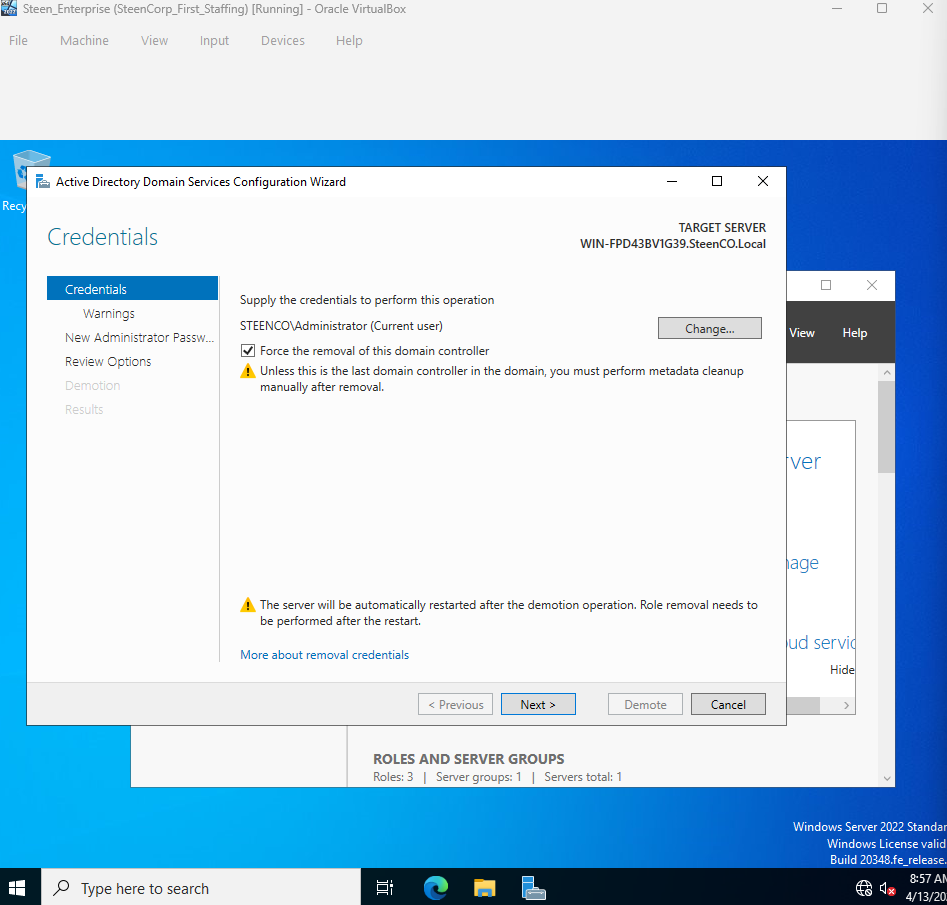
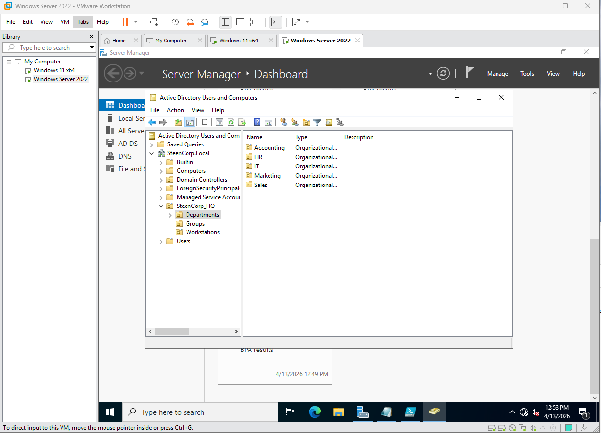
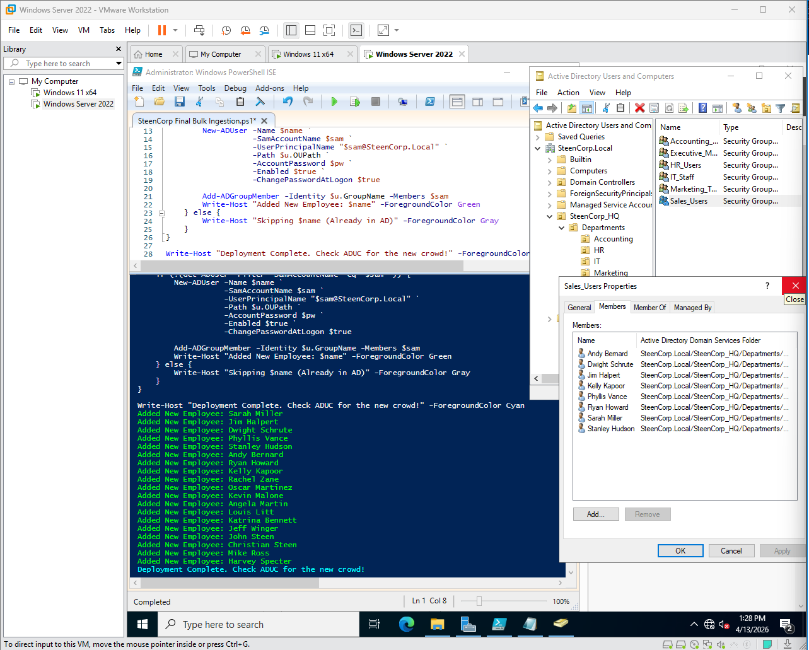
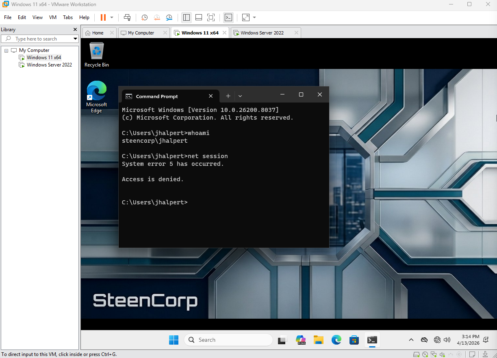

# Phase 1: Foundation and Environment Setup

## Objective

Build a reusable Windows domain environment with centralized authentication, an organized Active Directory structure, automated user provisioning, and a domain-joined Windows 11 workstation.

## Final Environment

- Hypervisor: VMware Workstation
- Domain controller: Windows Server 2022 named `DC01`
- Client: Windows 11
- Active Directory domain: `steencorp.local`
- Core services: Active Directory Domain Services and DNS

---

## Implementation

### Initial VirtualBox Deployment and VMware Migration

I initially deployed `DC01` and created the `steencorp.local` domain in VirtualBox. When I attempted to add a Windows 11 client, the virtual machine repeatedly booted to a black screen and prevented me from completing the client-side portion of the lab.

Because the environment was still early in development, I decided to rebuild it in VMware Workstation. Before retiring the original environment, I demoted the VirtualBox domain controller.

Instead of manually recreating every organizational unit, security group, and user, I converted the work I had already completed into PowerShell scripts. I then used those scripts to rebuild the Active Directory environment in VMware.

This allowed me to continue the project while making the environment faster to recreate and easier to expand.

<details>
<summary>View VirtualBox issue and migration evidence</summary>

**Windows 11 VirtualBox boot failure**


**Original domain controller demotion**



</details>

**Result:**

- Restored reliable Windows 11 operation
- Recreated the domain in VMware Workstation
- Automated the Active Directory structure instead of rebuilding it manually
- Established the virtualization platform used throughout the remaining phases

---

### Domain Controller Deployment

In VMware Workstation, I deployed Windows Server 2022 and named the server `DC01`.

I then:

- Installed the Active Directory Domain Services role
- Promoted `DC01` as the first domain controller
- Created a new forest with the root domain `steencorp.local`
- Installed DNS as part of the domain controller promotion
- Verified that Active Directory and DNS services were available

This provided centralized identity and authentication services for the lab.

---

### Active Directory Structure

I created a structured organizational unit hierarchy to separate departments, groups, and workstations.

The goal was to avoid relying on the default Active Directory containers and create a structure that could support later permissions, Group Policy, and administrative tasks.

#### OU Structure

- `SteenCorp_HQ`
  - `Departments`
    - `IT`
    - `Sales`
    - `HR`
    - `Accounting`
    - `Marketing`
  - `Groups`
  - `Workstations`

Departmental OUs contain the user accounts associated with each business department. Security groups are stored separately so they can be used for file permissions, drive mappings, and other access controls in later phases.

---

### PowerShell Provisioning

I created PowerShell scripts to automate the Active Directory work that had originally been completed manually in VirtualBox.

The scripts automate:

- Organizational unit creation
- Departmental security group creation
- Employee data generation
- CSV-based user provisioning
- User placement into the correct departmental OUs
- Departmental group assignments

CSV-based provisioning allowed me to populate the domain with enough users to support later access control, Group Policy, security, and help desk scenarios.

#### Deployment Scripts

- [OU Infrastructure Setup](./Scripts/SteenCorp%20OU%20Infrastructure%20Setup.ps1)
- [Security Group Infrastructure](./Scripts/SteenCorp%20Group%20Infrastructure.ps1)
- [Employee CSV Generator](./Scripts/Create%20Mega%20SteenCorp%20Employee%20CSV.ps1)
- [Bulk User Provisioning](./Scripts/SteenCorp%20Final%20Bulk%20Ingestion.ps1)

These scripts were created for the initial deployment of the lab. More advanced employee provisioning, validation, and failure handling are covered in [Phase 5: PowerShell Identity Lifecycle Automation](../Phase%205/).

---

### Windows 11 Domain Join

After rebuilding the domain, I deployed a Windows 11 client in VMware Workstation.

To connect the client to Active Directory, I:

- Configured the client to use `DC01` for internal DNS
- Joined the workstation to the `steencorp.local` domain
- Restarted the workstation
- Organized the computer account under the `Workstations` OU
- Signed in using a standard domain user account
- Verified that the user could authenticate through Active Directory

This confirmed that the rebuilt environment supported both the server and client sides of domain authentication.

---

## Validation

### Active Directory Structure

I verified the completed organizational unit hierarchy in Active Directory Users and Computers.

**Result:** The departments, groups, and workstation structure matched the intended design and was ready for later Group Policy and access-control configurations.



---

### Automated User Provisioning

I ran the bulk-provisioning script using CSV-defined employee information.

**Result:** User accounts were created and placed into their assigned departmental OUs.



---

### Domain Authentication

I signed in to the Windows 11 workstation using the standard domain account `rhoward`.

I ran `whoami` to verify the authenticated user.

**Result:** The workstation authenticated the account as:

```text
steencorp\rhoward
```

I also ran `net session` from the non-elevated session. The command returned `Access is denied`, confirming that the current command session was not running with elevated administrative privileges.


---

## Outcome

Phase 1 produced a functioning `steencorp.local` domain with a structured Active Directory hierarchy, departmental security groups, bulk-provisioned users, and a domain-joined Windows 11 workstation.

The PowerShell scripts also made the environment easier to rebuild after migrating from VirtualBox to VMware. This foundation supported the file access, Group Policy, networking, security, automation, and help desk scenarios developed in the following phases.

## What I Learned

- A working client environment is just as important as successfully deploying the server.
- PowerShell can turn manually completed infrastructure work into a repeatable deployment process.
- Active Directory structure affects how users, computers, permissions, and policies can be managed later.
- Testing with a standard user account helps verify the experience and restrictions employees actually receive.
- Rebuilding can be a practical troubleshooting decision when the environment is reproducible and the original platform is blocking further progress.
