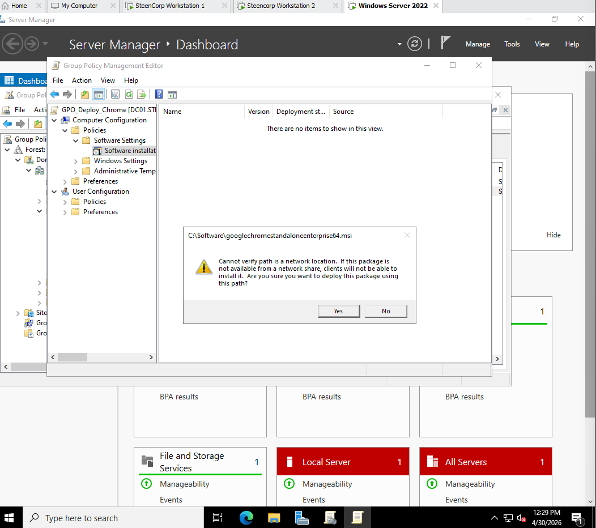
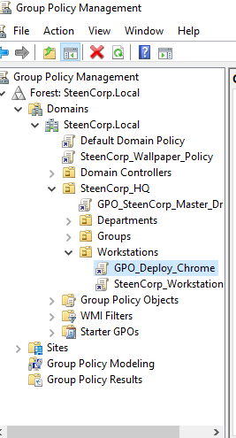
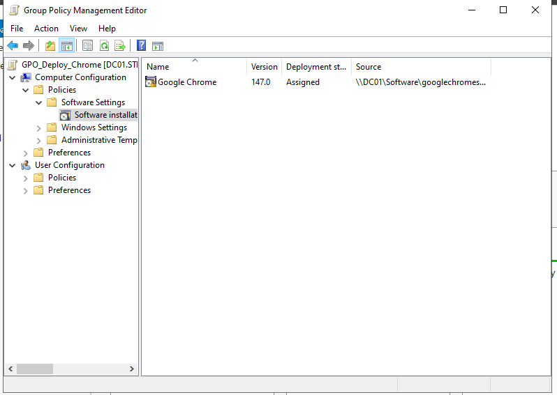
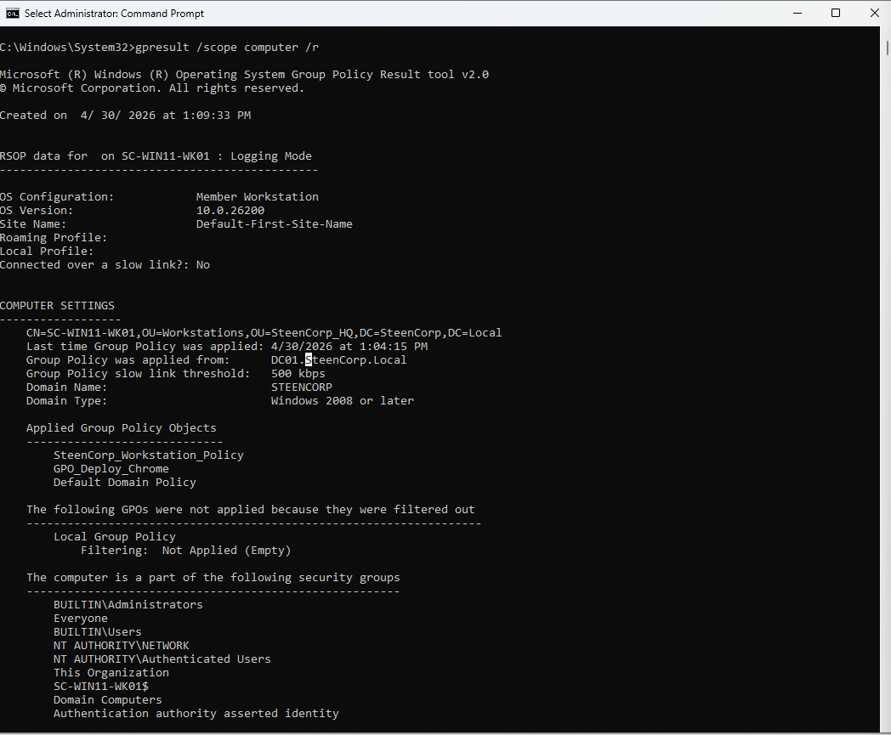
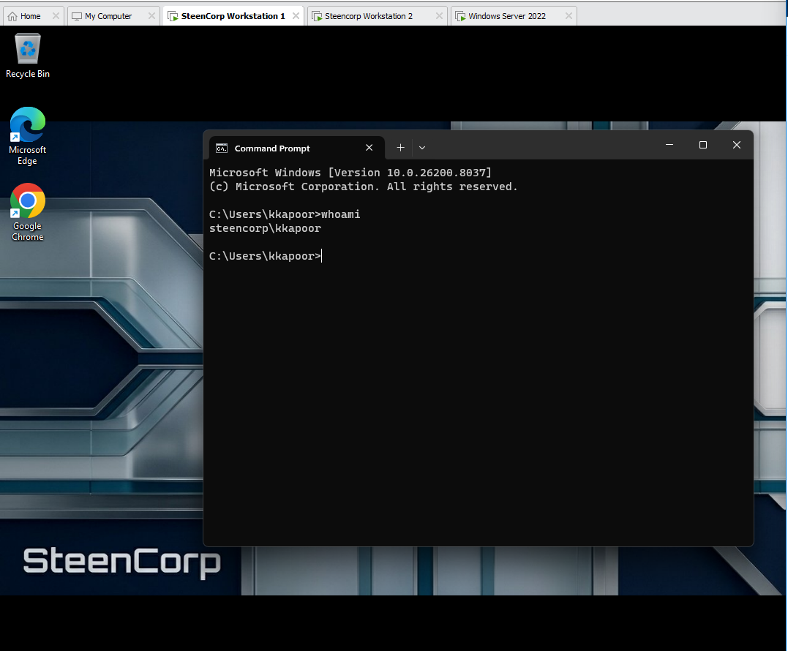
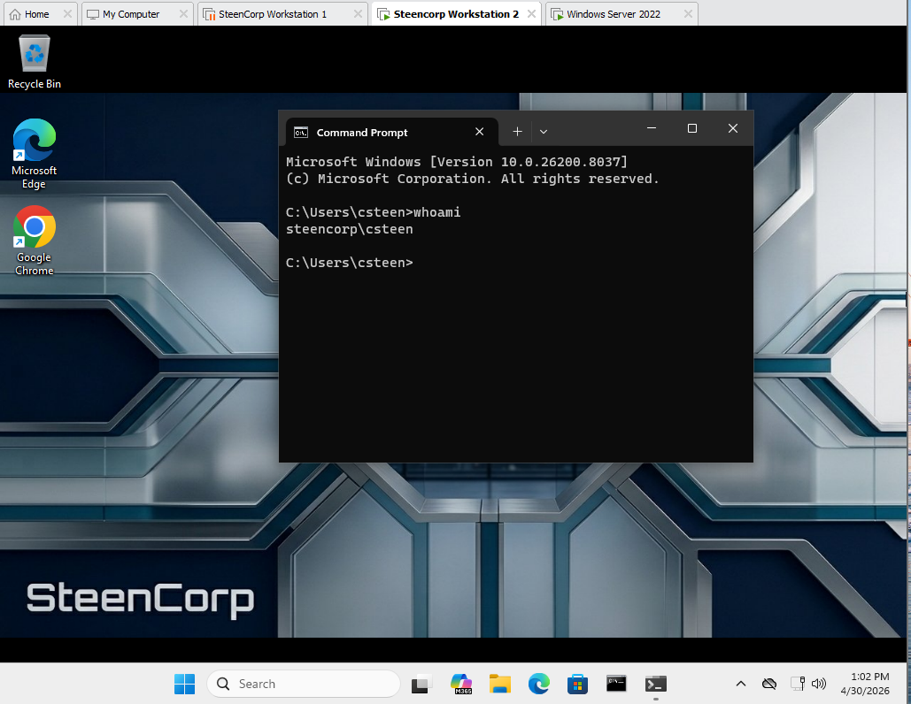

# Phase 2: Access Control, Group Policy, and Software Deployment

## Objective

Build centralized access control and workstation management using Active Directory security groups, Group Policy, mapped network drives, SMB and NTFS permissions, and software deployment.

This phase focused on two administrative goals:

1. Map department drives according to each user's role.
2. Deploy Google Chrome to domain joined workstations without installing it manually for every user.

## Environment

- Windows Server 2022 domain controller: `DC01`
- Active Directory domain: `steencorp.local`
- Windows 11 domain joined workstations
- Group Policy Management
- SMB file shares and NTFS permissions
- Google Chrome Enterprise MSI

## Policy Design

| Purpose | Configuration | GPO link |
|---|---|---|
| Department drive mappings | User Configuration | `Departments` OU |
| Google Chrome deployment | Computer Configuration | `Workstations` OU |

Drive mappings follow the signed in user and are selected through security group membership. Chrome is assigned to managed computers and remains available when different domain users sign in.

---

## Department Drive Mapping

### Access Model

I assigned access to security groups instead of individual users.

| Resource | Drive | Network path | Authorized group |
|---|---:|---|---|
| HR | H: | `\\DC01\SteenCorp_Shares\HR` | `HR_Users` |
| Sales | S: | `\\DC01\SteenCorp_Shares\Sales` | `Sales_Users` |
| IT | I: | `\\DC01\SteenCorp_Shares\IT` | `IT_Staff` |
| Accounting | A: | `\\DC01\SteenCorp_Shares\Accounting` | `Accounting_Users` |
| Public | P: | `\\DC01\SteenCorp_Shares\Public` | `Domain Users` |

This design allows an employee's access to change through group membership rather than through individual drive or folder permissions.

### Group Policy Configuration

I consolidated the department mappings into one policy:

```text
GPO_SteenCorp_Master_Drive_Map
```

The mappings are configured under:

```text
User Configuration
└── Preferences
    └── Windows Settings
        └── Drive Maps
```

Because this is a user policy, I linked it to the `Departments` OU containing the department user OUs.


Each preference item uses:

- Action: `Replace`
- Reconnect enabled
- Item level targeting based on the appropriate security group
- **Remove this item when it is no longer applied** enabled

Group Policy Preferences requires `Replace` when automatic removal is enabled. This ensures that a department drive is removed when a user no longer belongs to its target group.


The HR mapping below demonstrates the security group targeting used for each department.


### Share and NTFS Permissions

The root SMB share provides network access:

```text
Authenticated Users: Change and Read
Administrators: Full Control
```

NTFS permissions enforce authorization on each department folder:

```text
HR          → HR_Users: Modify
Sales       → Sales_Users: Modify
IT          → IT_Staff: Modify
Accounting  → Accounting_Users: Modify
Public      → Domain Users: Modify
```

Administrators and SYSTEM retain Full Control. Public is available to all domain users, while the department folders are limited to their assigned groups.


Group Policy determines which drives appear for the user. SMB and NTFS permissions determine whether that user is authorized to access the underlying data.

### User Validation

I tested the final configuration with standard accounts from HR and Sales.

For HR user `steencorp\mross`, validation confirmed:

- `GPO_SteenCorp_Master_Drive_Map` applied
- H: and P: mapped successfully
- HR and Public were accessible
- Direct access to Sales returned `Access is denied`


For Sales user `steencorp\rhoward`, validation confirmed:

- `GPO_SteenCorp_Master_Drive_Map` applied
- S: and P: mapped successfully
- Sales and Public were accessible
- Direct access to HR returned `Access is denied`


These tests verified both policy delivery and cross department access restrictions.

### Troubleshooting

The original configuration used the server's previous hostname, mapped the root share instead of each department folder, and split the mappings across multiple GPOs.

I corrected the paths to use `DC01`, consolidated the mappings into one GPO, and applied item level targeting to each drive. I also corrected the GPO scope after confirming that drive mappings under User Configuration must be linked to an OU containing user objects. The `Workstations` OU remains the correct scope for computer policies such as software deployment.

---

## Google Chrome Deployment

### Software Repository

I stored the Google Chrome Enterprise MSI on `DC01` and made it available through:

```text
\\DC01\Software\googlechromestandaloneenterprise64.msi
```

`Domain Computers` received read access so workstation computer accounts could retrieve the installer during startup.

### Local Path Failure

My first deployment attempt selected the MSI through the server's local path:

```text
C:\Software\googlechromestandaloneenterprise64.msi
```

Group Policy warned that the package was not available from a network location. A local `C:\` path on the server cannot be used by client workstations, so I corrected the source to the UNC path.



### Chrome GPO Configuration

I created:

```text
GPO_Deploy_Chrome
```

The policy is linked to the `Workstations` OU because the software installation is configured under Computer Configuration.



The MSI is assigned under:

```text
Computer Configuration
└── Policies
    └── Software Settings
        └── Software Installation
```

Final settings:

```text
Security filtering: Domain Computers
Deployment type: Assigned
Package: \\DC01\Software\googlechromestandaloneenterprise64.msi
```



### Computer Validation

Because Chrome was deployed through Computer Configuration, I validated the computer scope:

```cmd
gpresult /scope computer /r
```

The result confirmed that `GPO_Deploy_Chrome` applied to the workstation.



Computer assigned software is processed during startup. After refreshing policy and restarting the clients, Chrome installed on both managed workstations and remained available when different domain users signed in.





---

## Outcome

Phase 2 produced two centralized management systems:

- Department drives map according to user security group membership.
- SMB and NTFS permissions block unauthorized cross department access.
- All drive mappings are maintained in one user GPO linked to the `Departments` OU.
- Chrome is assigned through a computer GPO linked to the `Workstations` OU.
- User and computer policies were validated with the appropriate `gpresult` scope.

## Production Considerations

This lab uses `DC01` to host department folders and software packages. A production environment would normally place these resources on dedicated file and software distribution servers.

Larger environments may also use Microsoft Intune or Configuration Manager for application deployment and device management.

## What I Learned

- User and computer policies must be linked to OUs containing the correct object type.
- Item level targeting allows one drive mapping GPO to support multiple departments.
- A visible mapped drive does not grant access by itself; SMB and NTFS permissions enforce authorization.
- Group Policy software deployment requires a reachable UNC path.
- Computer assigned software should be verified through computer scope policy results.
