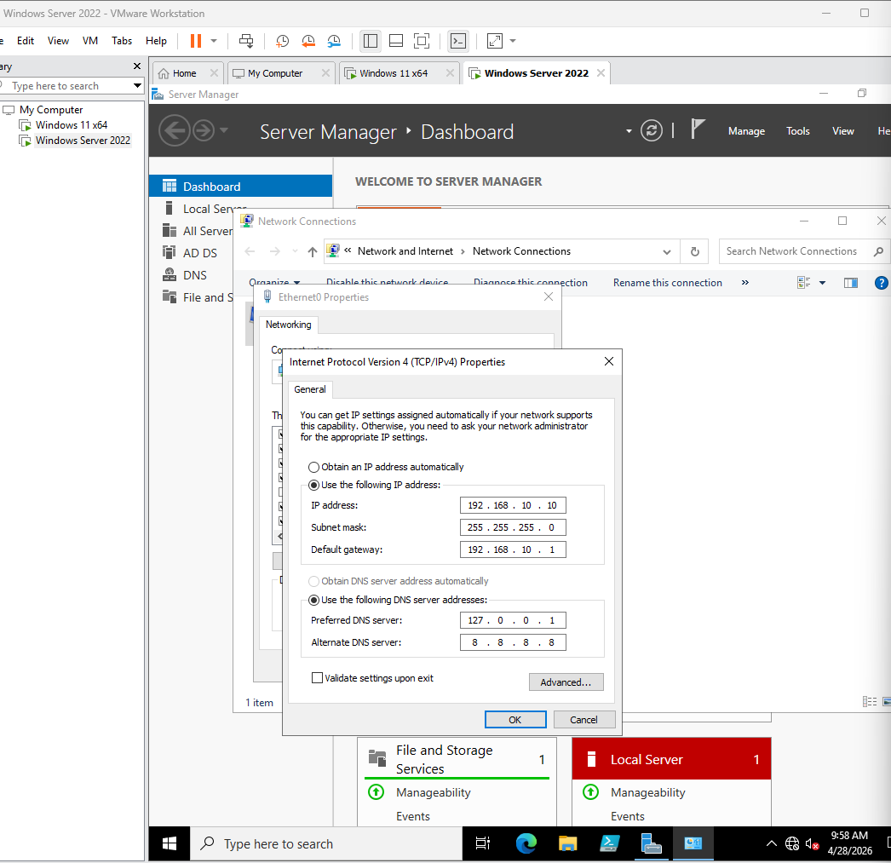
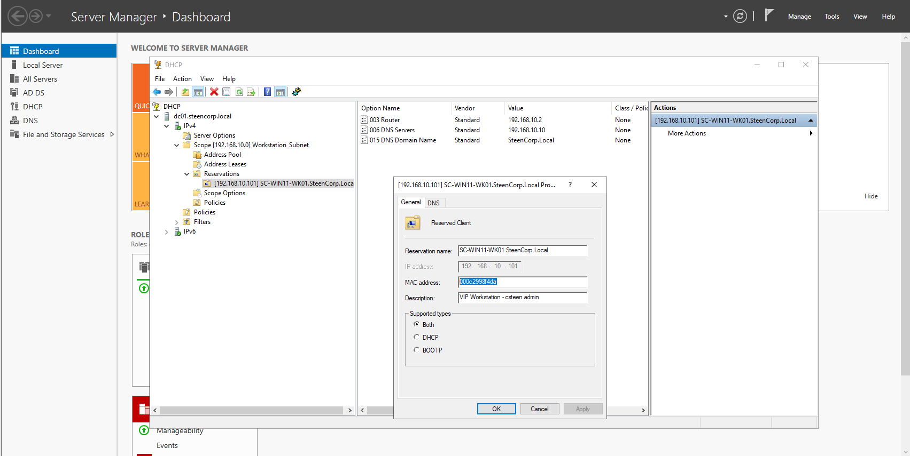
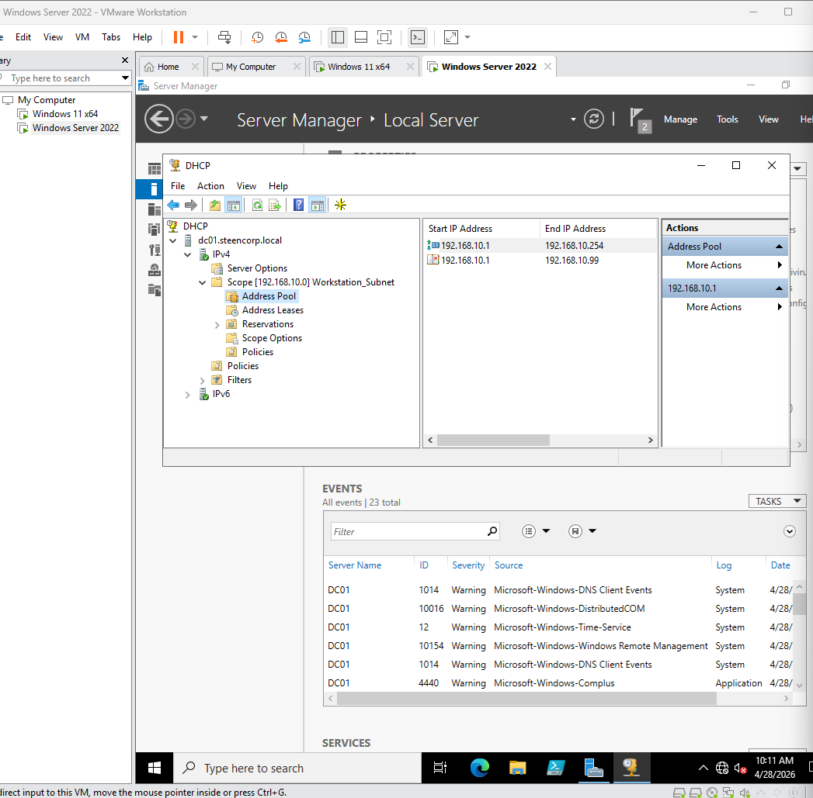
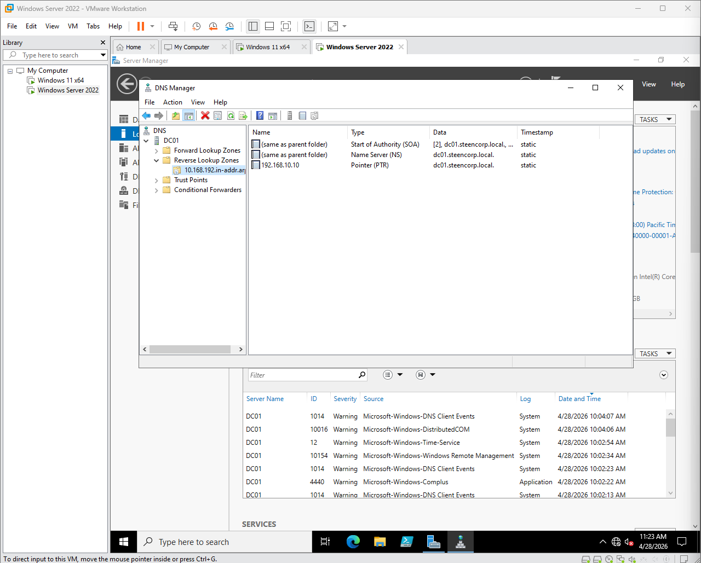
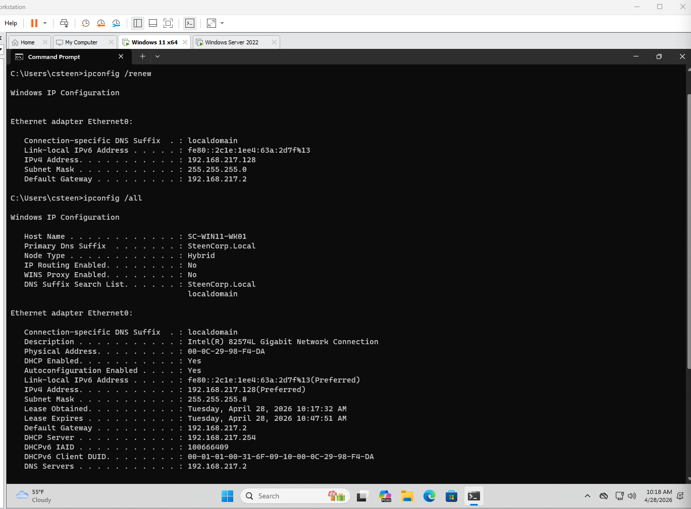
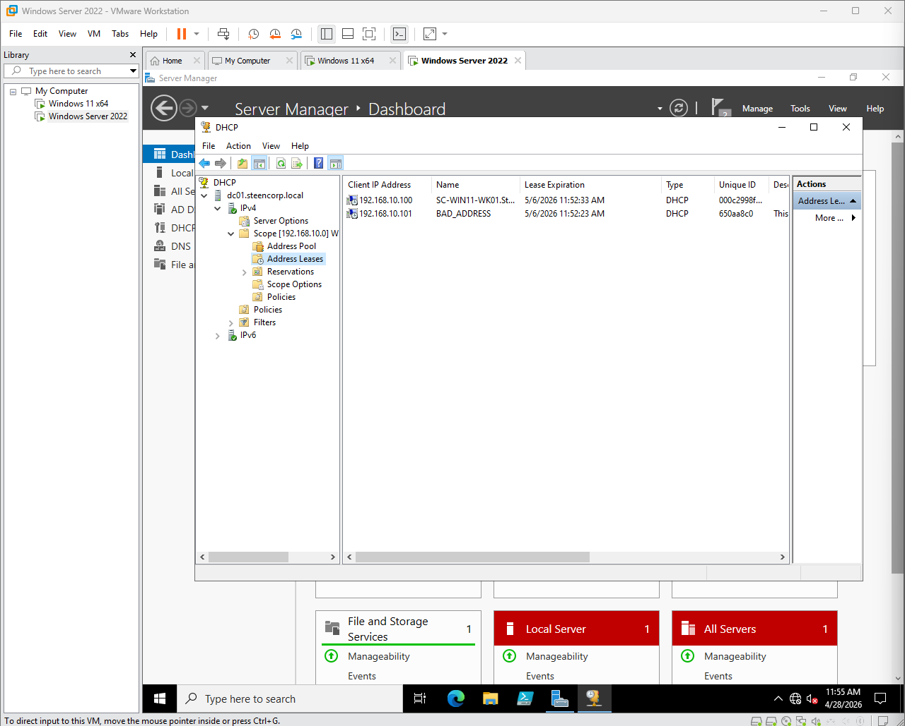
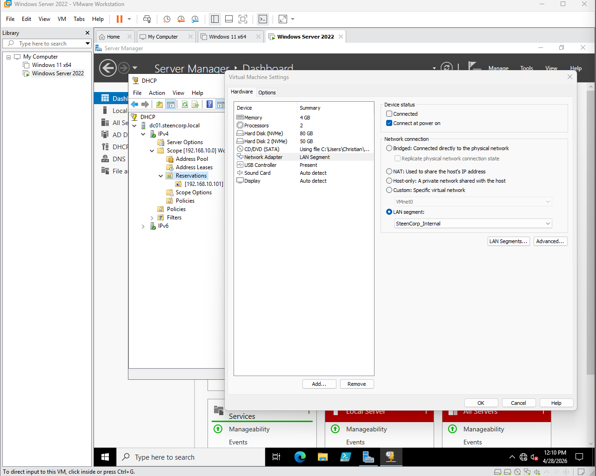
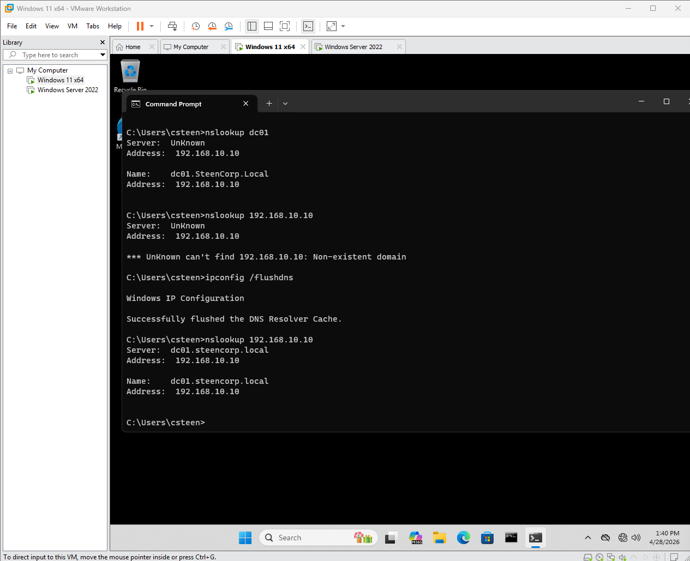
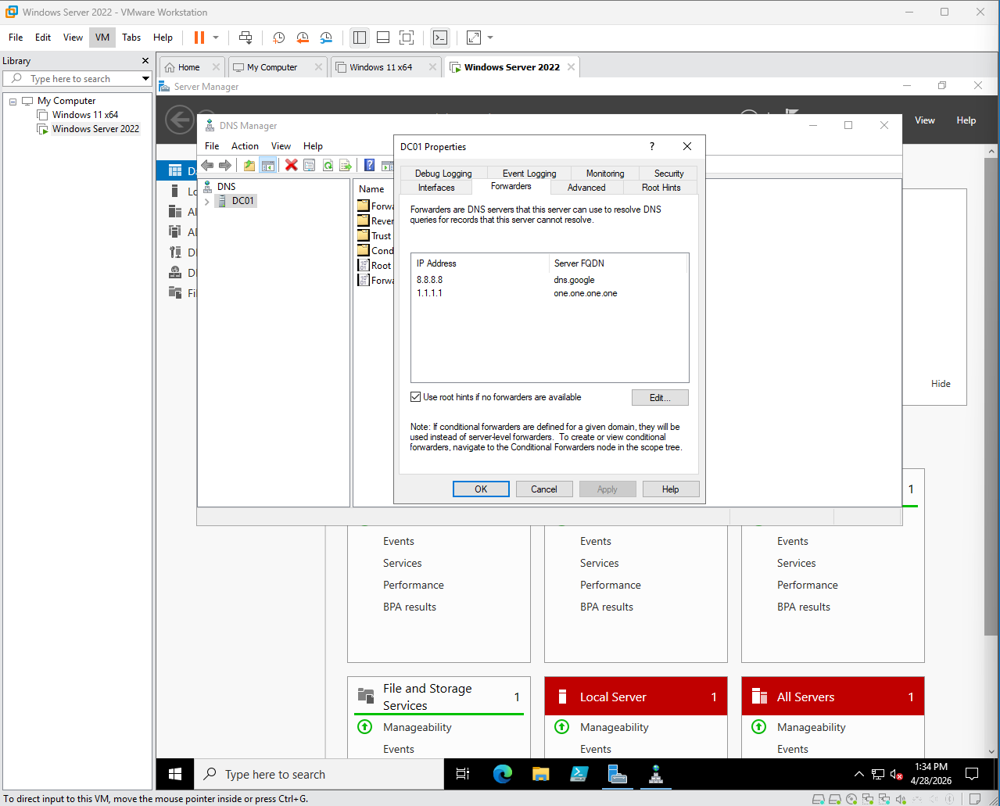
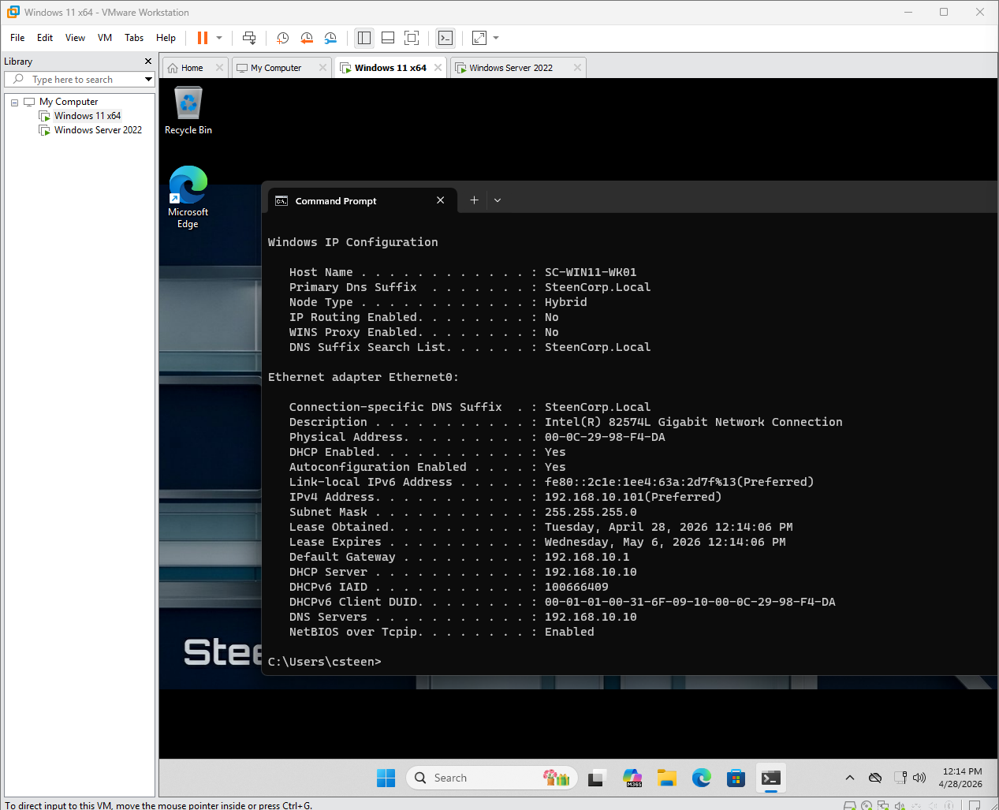

# Phase 3 – Networking & Domain Connectivity

## Objective

Configure DHCP and DNS for the SteenCorp domain, validate client connectivity, and troubleshoot the VMware networking issues that affected address assignment and internet access.

This phase began as a basic Windows Server networking build. It became a practical troubleshooting exercise when a client received an address from the wrong DHCP server and a later help desk ticket revealed that the isolated domain network had no route to the internet.

---

## Current Network Design

| Component | Configuration |
|---|---|
| Domain | `steencorp.local` |
| Domain Controller | `DC01` |
| DC01 IP Address | `192.168.10.10` |
| Subnet | `192.168.10.0/24` |
| DHCP Server | `192.168.10.10` |
| DNS Server | `192.168.10.10` |
| Default Gateway | `192.168.10.2` |
| Client DHCP Range | `192.168.10.100–192.168.10.254` |
| VMware Network | NAT-backed `VMnet8` |
| VMware DHCP | Disabled |

DC01 provides DHCP and DNS for the domain. VMware provides the NAT gateway that allows the virtual machines to reach external networks.

---

## 1. Initial Server Configuration

I planned a single `192.168.10.0/24` network and assigned DC01 a static address so domain clients could reliably locate DNS and other Active Directory services.

| Purpose | Address or Range |
|---|---|
| VMware NAT Gateway | `192.168.10.2` |
| Domain Controller | `192.168.10.10` |
| Reserved Server Addresses | `192.168.10.11–192.168.10.20` |
| Reserved Static Addresses | `192.168.10.21–192.168.10.99` |
| DHCP Client Range | `192.168.10.100–192.168.10.254` |

The screenshot below records the original Phase 3 server configuration. At that point, `192.168.10.1` was entered as the planned gateway. The active VMware NAT gateway was later verified as `192.168.10.2` and the configuration was corrected.



### DHCP

I installed DHCP on DC01 and created a scope for domain workstations. The final scope provides:

| DHCP Option | Value |
|---|---|
| Address Range | `192.168.10.100–192.168.10.254` |
| Option 003 Router | `192.168.10.2` |
| Option 006 DNS Server | `192.168.10.10` |
| Option 015 DNS Domain | `steencorp.local` |

I also created a DHCP reservation to practice assigning a predictable address to a specific device.

I created a DHCP reservation for `SC-WIN11-WK01`, mapping the workstation’s MAC address to `192.168.10.101`. This allows the workstation to keep a predictable IP address while still receiving its network configuration from DHCP.





### DNS

I configured DNS for the Active Directory domain with:

- A forward lookup zone for `steencorp.local`
- A reverse lookup zone for `192.168.10.0/24`
- PTR records for reverse resolution
- Forwarders for external DNS requests



---

## 2. Troubleshooting the Wrong DHCP Source

After renewing the workstation lease, the client received:

```text
IP address: 192.168.217.128
DHCP server: 192.168.217.254
Default gateway: 192.168.217.2
```

Those values did not belong to the planned SteenCorp network. The output showed that the workstation was attached to VMware's NAT network and receiving a lease from VMware instead of DC01.



I used the following commands to release the existing lease, request a new one, and review the complete client configuration:

```cmd
ipconfig /release
ipconfig /renew
ipconfig /all
```

During testing, the DHCP console also displayed a `BAD_ADDRESS` entry for `192.168.10.101`. This confirmed that Windows DHCP conflict detection had quarantined that address. The entry alone did not identify the conflicting device, so I treated it as supporting evidence rather than the complete root cause.



### Initial Correction

I first moved the domain controller and workstation onto an isolated VMware LAN Segment. This removed VMware DHCP from the client path and allowed DC01 to become the only DHCP and DNS source on the internal network.



After renewing the lease, the workstation received an address in the correct subnet and used DC01 for both DHCP and DNS:

| Setting | Initial Internal Result |
|---|---|
| Client IP | `192.168.10.101` |
| DHCP Server | `192.168.10.10` |
| DNS Server | `192.168.10.10` |
| Default Gateway | `192.168.10.1` |

This stabilized internal domain connectivity, but the LAN Segment was isolated and did not provide a working route to the internet. That limitation was discovered later through SteenDesk Ticket #006.

---

## 3. DNS Validation

I validated DNS from a domain workstation instead of relying only on the server console.

The first reverse lookup failed. After refreshing the DNS registration and client resolver cache, the workstation successfully resolved:

```cmd
nslookup dc01
nslookup 192.168.10.10
```

This confirmed both forward and reverse name resolution for DC01.



I also configured DNS forwarders so DC01 could handle external name-resolution requests without assigning public DNS directly to domain clients.



The original internal validation showed that the client received its address from DC01 and used DC01 for DNS. The screenshot still shows the original `192.168.10.1` gateway, which was corrected during the later routing investigation.



---

## 4. Routing Issue Discovered Through Ticket #006

After the initial Phase 3 build, Mike Ross reported that he could sign in to the domain and reach internal resources but could not access the internet.

Testing from his workstation showed:

- A valid DHCP lease from DC01
- DC01 assigned as the DNS server
- Successful connectivity to DC01 at `192.168.10.10`
- Successful external DNS resolution through DC01
- Failed connectivity to the configured gateway
- Failed connectivity to external IP address `8.8.8.8`

The key result was that `google.com` resolved to an IP address, but external traffic still failed. This separated DNS from routing and showed that name resolution was not the root cause.

### Root Cause

The virtual machines were configured like this:

| System | Network Connection |
|---|---|
| DC01 | Internal LAN Segment plus a separate NAT adapter |
| Workstation 1 | Internal LAN Segment only |
| Workstation 2 | Internal LAN Segment only |

DC01 could reach the internet through its own NAT adapter, but it was not configured to route or translate traffic for the workstations. The isolated clients therefore had no valid path to the internet.

---

## 5. Final Network Correction

I moved DC01 and both workstations from the isolated LAN Segment to a custom NAT-backed `VMnet8`.

The corrected design used:

- `VMnet8` configured for `192.168.10.0/24`
- VMware NAT gateway `192.168.10.2`
- VMware DHCP disabled
- DC01 retained as the DHCP and DNS server
- DHCP Option 003 updated to `192.168.10.2`
- DHCP Option 006 retained as `192.168.10.10`

This preserved centralized Windows Server DHCP and DNS while giving every virtual machine a valid route through VMware NAT.

After renewing the client leases, I validated the correction from DC01 and two workstations:

- Clients received addresses from the SteenCorp DHCP scope
- Clients received gateway `192.168.10.2`
- Clients continued using DC01 for DNS
- Internal domain resources remained reachable
- External IP connectivity worked
- External DNS resolution worked
- Browser internet access worked

Testing a second workstation exposed one additional issue: its adapter had been manually configured to use `8.8.8.8` for DNS. I returned it to automatic DNS assignment, renewed the lease, and confirmed that it received `192.168.10.10` from DHCP.

The complete troubleshooting record and current-state screenshots are documented here:

[SteenDesk Ticket #006 – Mike Ross Cannot Access Internet](https://github.com/CSteen57/SteenDesk_Help_Desk_Simulation/blob/main/Helpdesk_Tickets/Tickets/Ticket006_Mike_Ross_Cannot_Access_Internet.md)

---

## What I Learned

- A valid IP address does not prove that the client received it from the intended DHCP server.
- `ipconfig /all` is essential because it identifies the DHCP server, DNS server, gateway, and lease information in one place.
- A `BAD_ADDRESS` entry confirms DHCP conflict detection, but additional evidence is needed to identify the cause.
- Active Directory clients should use the domain DNS server rather than public DNS directly.
- Successful DNS resolution does not prove that routing or internet connectivity works.
- A server having internet access does not automatically make it a router for other systems.
- VMware network settings are part of the infrastructure and must be included in troubleshooting.
- Testing the final correction on more than one workstation can reveal device-specific configuration problems.
