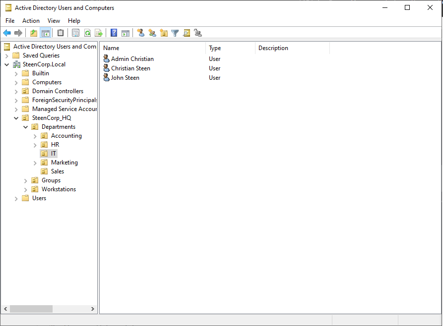
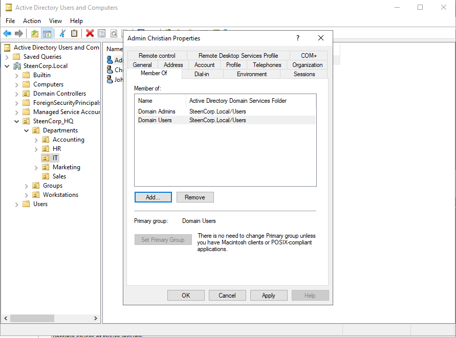
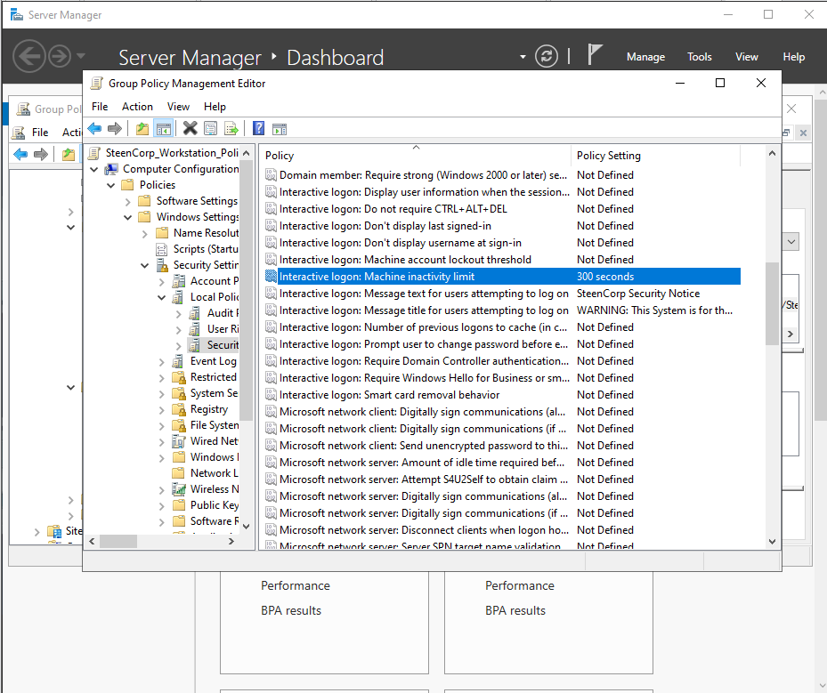
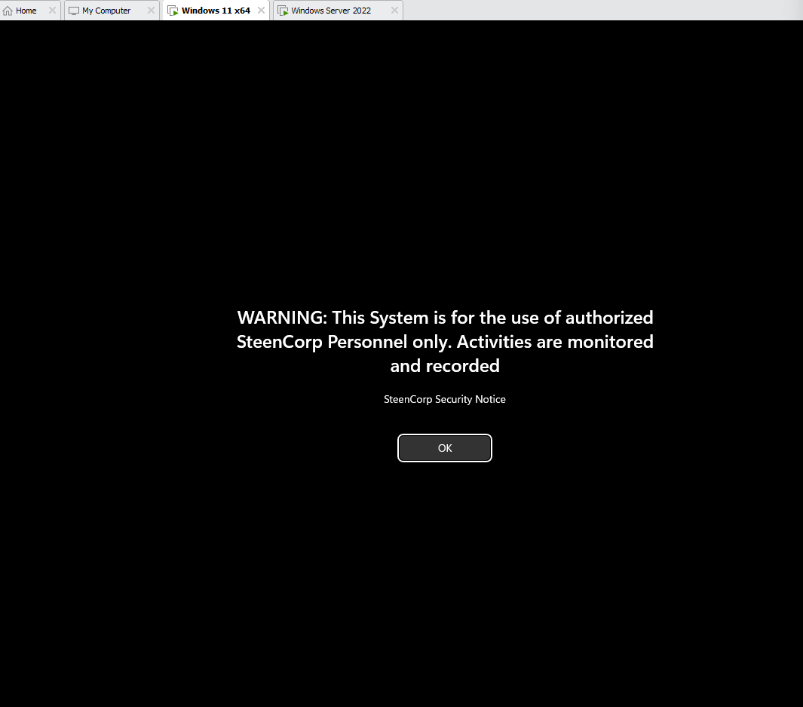
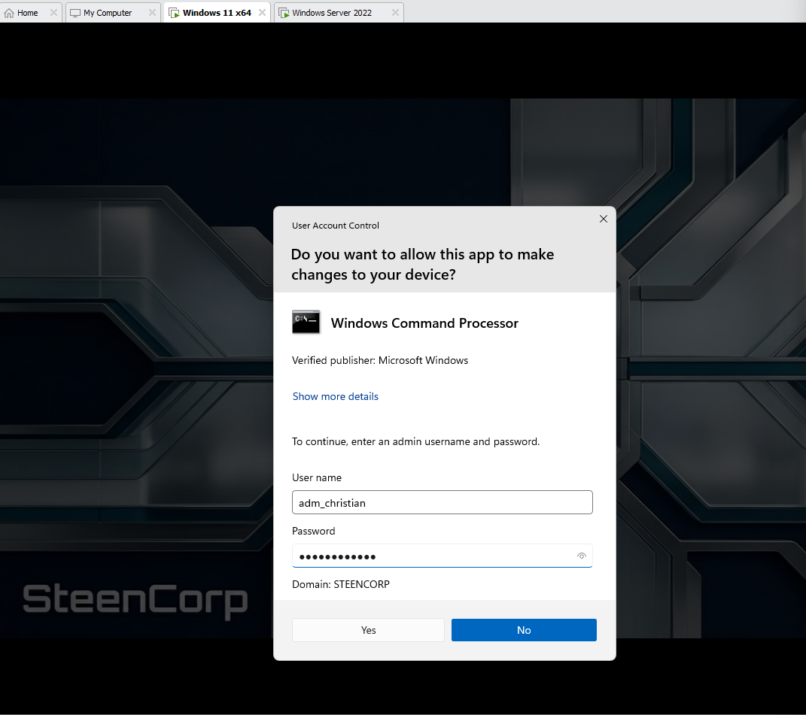
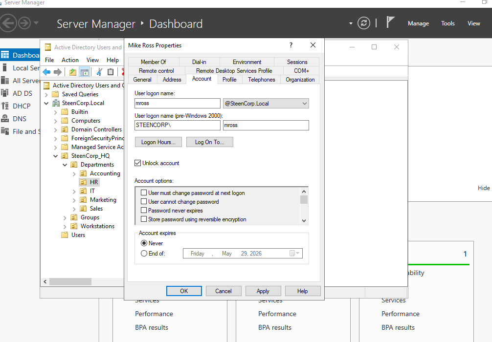
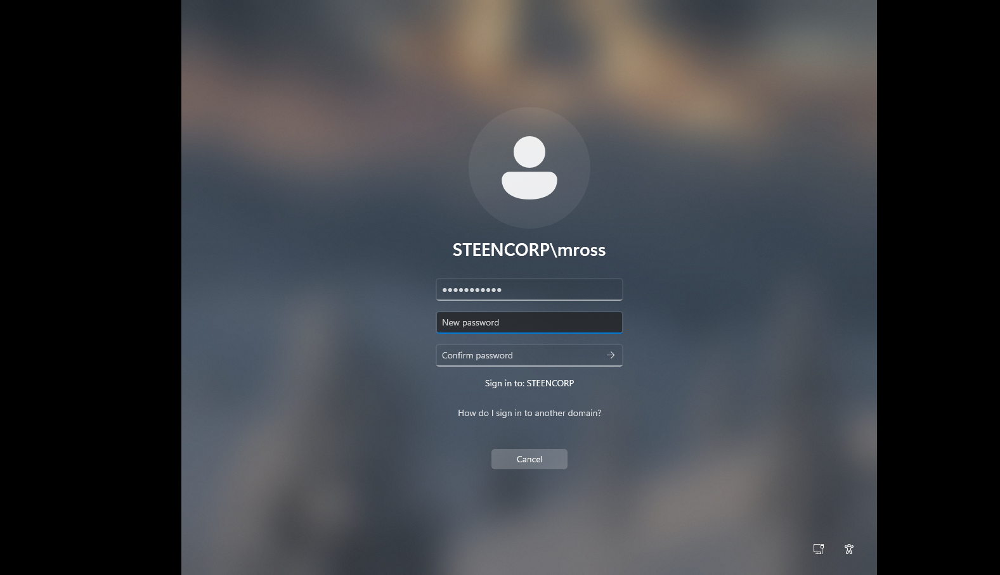

# Phase 4 – Security and Enterprise Controls

## Objective

Strengthen the SteenCorp domain by separating standard and administrative access, enforcing security policies through Group Policy, and validating those controls from a domain-joined workstation.

This phase built on the Active Directory, Group Policy, access control, and networking foundations completed in the earlier phases.

## Environment

- Windows Server 2022 domain controller: `DC01`
- Active Directory domain: `steencorp.local`
- Windows 11 domain-joined workstations
- Active Directory Users and Computers
- Group Policy Management
- User Account Control

## Security Design

| Control | Implementation | Purpose |
|---|---|---|
| Administrative separation | Dedicated `adm_christian` account | Separate standard and privileged activity |
| Account lockout | Lock after 5 failed attempts | Reduce repeated password guessing |
| Login banner | Computer Group Policy | Display an authorized-use notice |
| Inactivity lock | 300-second machine inactivity limit | Protect unattended workstations |
| Administrative elevation | UAC with separate admin credentials | Maintain least privilege for standard users |

---

## Administrative Account Separation

I created a dedicated administrative account instead of using my standard domain account for privileged work.

```text
Account: adm_christian
Location: SteenCorp_HQ → IT OU
Group: Domain Admins
```

My standard account remained available for normal user activity. The administrative account was reserved for tasks requiring elevated permissions.





This provided:

- Clear separation between standard and privileged activity
- Better accountability through a named administrator account
- Reduced dependence on the built-in Administrator account
- A foundation for least-privilege administration

This lab does not implement a complete enterprise privileged-access model, but it demonstrates the core practice of maintaining separate standard and administrative identities.

---

## Workstation Security Group Policy

I used Group Policy to apply security controls centrally to the domain-joined Windows workstations.

The computer policy was linked to the `Workstations` OU so its settings applied to the managed client computers.

### Login Security Banner

I configured a legal notice that appears before users sign in.

The banner identifies the workstation as an authorized-use system and warns users that activity may be monitored.

The settings were configured under:

```text
Computer Configuration
└── Policies
    └── Windows Settings
        └── Security Settings
            └── Local Policies
                └── Security Options
```

The policy uses the following settings:

```text
Interactive logon: Message title for users attempting to log on
Interactive logon: Message text for users attempting to log on
```



The banner appeared on the workstation before sign-in, confirming that the computer received and enforced the policy.



### Workstation Inactivity Lock

I also configured the workstation to lock after five minutes of inactivity.

```text
Interactive logon: Machine inactivity limit
Value: 300 seconds
```

This setting reduces the risk of an unattended workstation remaining accessible to another person. Authentication is required before the user can regain access to the session.

The updated Group Policy evidence above shows the machine inactivity limit defined as `300 seconds`.

---

## Account Lockout Policy

I configured a domain account lockout policy that locks a user account after five failed sign-in attempts.

```text
Account lockout threshold: 5 invalid attempts
```

The policy helps reduce repeated password guessing and creates a realistic account-recovery workflow for help desk testing.

Domain account lockout settings are configured under:

```text
Computer Configuration
└── Policies
    └── Windows Settings
        └── Security Settings
            └── Account Policies
                └── Account Lockout Policy
```

Because this setting controls domain user accounts, it must be applied through a domain-level account policy rather than only through a GPO linked to the `Workstations` OU.

---

## Privileged Elevation Testing

I tested an administrative task while operating as a standard domain user.

When Windows required elevated permission, I entered the credentials for `adm_christian` through User Account Control instead of granting administrative rights to the standard account.



This confirmed that:

- The standard user did not have unnecessary administrative privileges
- Elevated actions required separate administrative credentials
- The dedicated administrative account could perform approved tasks
- The user could complete normal work without local administrator membership

---

## Account Lockout and Recovery Validation

I validated the complete account lockout policy from both the user and administrator perspectives.

### 1. Triggering the Lockout

I intentionally entered an incorrect password five times for a standard domain user.

The account was locked after reaching the configured threshold and could no longer sign in.


### 2. Administrative Recovery

I used the dedicated administrative account to locate the user in Active Directory and unloxck the account.

```text
User reports sign-in failure
↓
Administrator confirms the account is locked
↓
Administrator unlocks the account
↓
User tests access again
```



### 3. Password Change and Access Restoration

As part of the recovery process, I reset the user’s password and selected **User must change password at next logon**. When `STEENCORP\mross` attempted to sign in, Windows required the user to create a new password. After completing the password change, the user successfully regained access to the workstation.



This validated the entire workflow instead of assuming the policy worked based only on its server-side configuration.

---

## Related Help Desk Validation

The security controls from this phase were later used in the separate [SteenDesk Help Desk Simulation](https://github.com/CSteen57/SteenDesk_Help_Desk_Simulation).

- [Ticket #002 – User Account Locked Out](https://github.com/CSteen57/SteenDesk_Help_Desk_Simulation/blob/main/Helpdesk_Tickets/Tickets/Ticket002_User_Account_Locked_Out.md) used the account lockout policy to simulate administrative recovery and successful restoration of user access.
- [Ticket #005 – Approved Software Installation](https://github.com/CSteen57/SteenDesk_Help_Desk_Simulation/blob/main/Helpdesk_Tickets/Tickets/Ticket005_Approved_Software_Install.md) demonstrated UAC elevation for an approved installation without granting the standard user administrative rights.

These tickets show how the security controls were later used in realistic support scenarios.

---

## Help Desk Connection

This phase created several common help desk and desktop-support workflows:

- Investigating a user who cannot sign in
- Identifying and unlocking a locked domain account
- Confirming access after account recovery
- Using separate credentials for an elevated task
- Explaining why a standard user cannot perform an administrative action
- Confirming that a workstation received its security policies
- Maintaining least privilege while assisting users

The lockout test demonstrates both security-policy enforcement and a common Active Directory support responsibility.

---

## Outcome

By the end of Phase 4:

- A dedicated named administrative account was created
- Standard and administrative activity were separated
- Domain Admins membership was validated
- A login security banner was deployed through Group Policy
- Workstations were configured to lock after 300 seconds of inactivity
- Domain accounts were configured to lock after five failed attempts
- UAC elevation was tested using separate administrative credentials
- Account lockout, administrative recovery, and restored access were validated
- The controls were reused in later help desk simulation tickets

---

## Production Considerations

`Domain Admins` provides extensive control over the entire domain. In a production environment, routine workstation and help desk tasks would normally use delegated administrative roles instead of full Domain Admin membership.

A larger environment might also implement:

- Separate workstation and server administrator accounts
- Delegated account-unlock permissions for help desk staff
- Fine-grained password and lockout policies
- Multifactor authentication for privileged accounts
- Privileged identity management
- Centralized security auditing and alerting

---

## What I Learned

- Standard and administrative accounts should be kept separate.
- Named administrator accounts provide better accountability than shared or default accounts.
- Security settings must be linked at the correct scope for the accounts or computers they control.
- Domain account policies and workstation policies serve different purposes.
- Group Policy should be validated from the client instead of relying only on server-side configuration.
- UAC helps maintain the boundary between standard and privileged activity.
- Account lockout and recovery are both security controls and common help desk responsibilities.
- Least privilege must be validated through actual user behavior.
