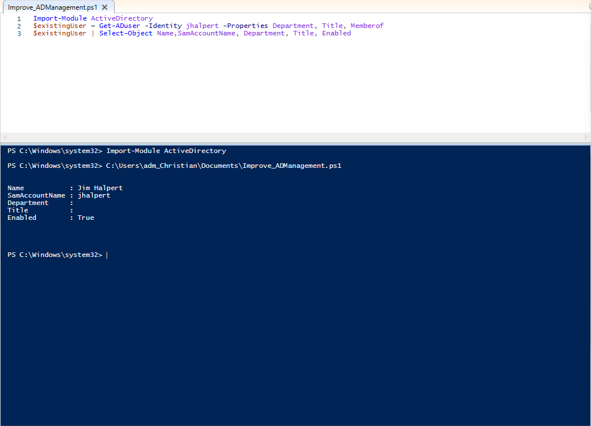
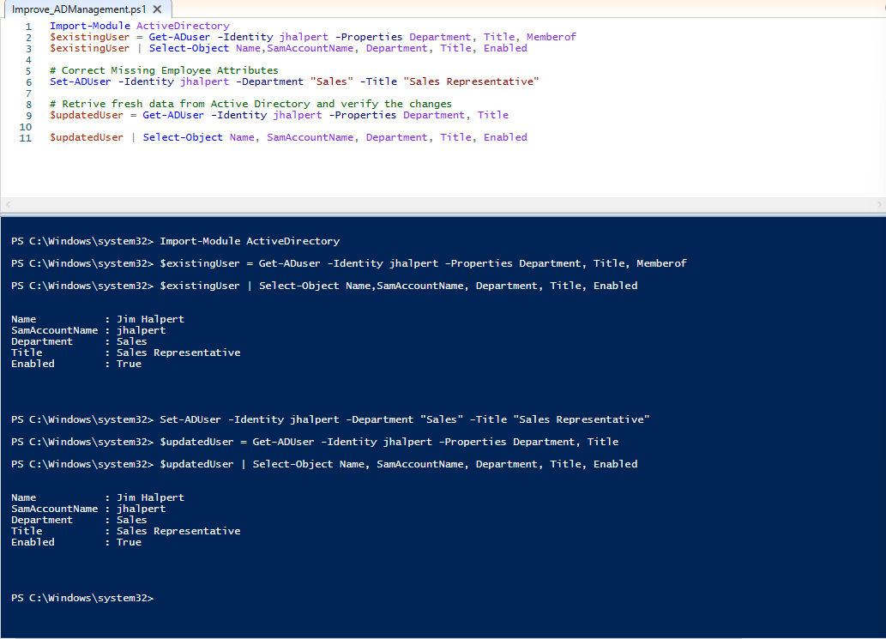
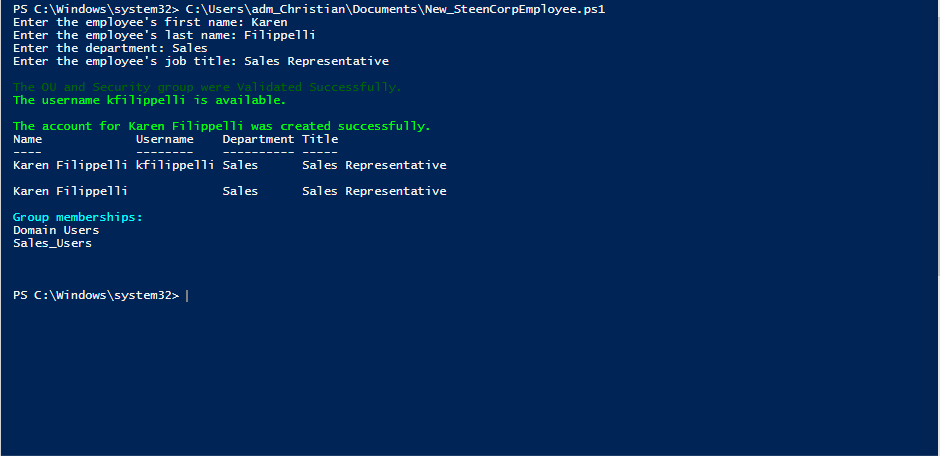
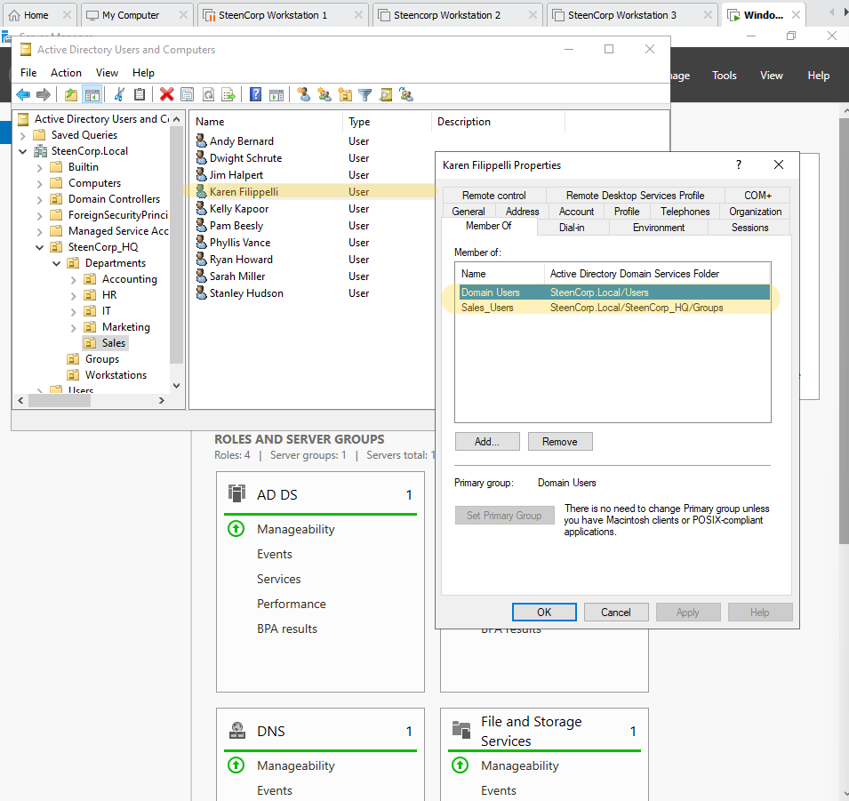
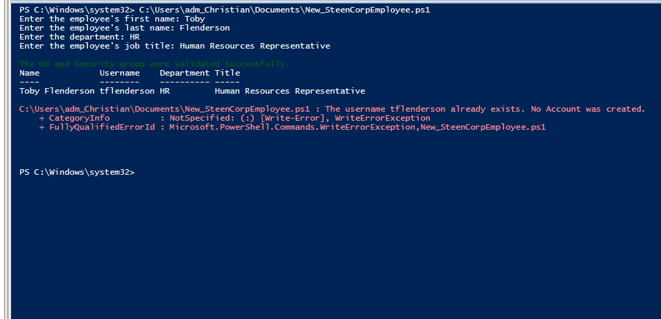
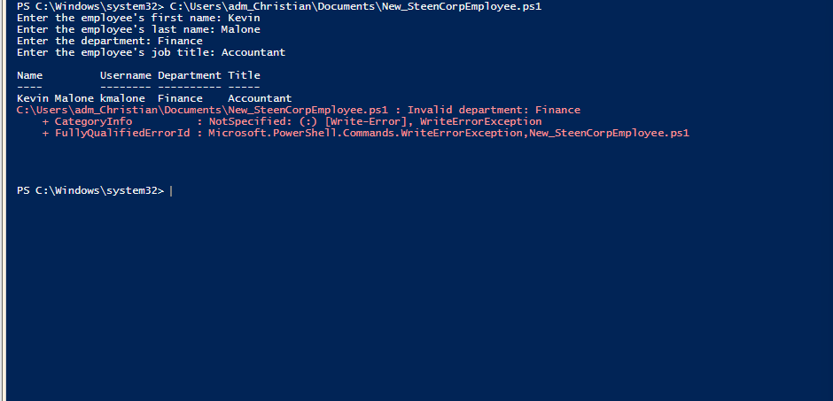

# Phase 5 – PowerShell Identity Lifecycle Automation

**Status:** In Progress

## Objective

Use the completed SteenCorp Active Directory environment to practice repeatable employee administration with PowerShell. This phase begins with a tested onboarding tool and will later expand into offboarding and access auditing.

## Why This Is a Separate Phase

The Phase 1 scripts built the original domain structure and populated the lab in bulk. Phase 5 focuses on ongoing administrative work after the environment is already running.

```text
Build the environment in bulk
↓
Administer individual employee accounts
↓
Audit and improve identity lifecycle controls
```

---

## From Individual Commands to a Reusable Tool

Before building the onboarding tool, I used `Get-ADUser` and `Set-ADUser` to identify and correct missing employee attributes. I then retrieved the account again to verify the change.

| Before | After |
|---|---|
|  |  |
| Department and title were missing. | `Set-ADUser` populated both attributes, and `Get-ADUser` verified the change. |

This inspect, modify, and verify pattern became the foundation for the complete onboarding workflow.

---

## Reusable Employee Onboarding Tool

I created [`New_SteenCorpEmployee.ps1`](./Scripts/New_SteenCorpEmployee.ps1) to standardize the onboarding of individual employees.

The script:

1. Collects the employee's name, department, and job title.
2. Generates a username.
3. Maps the department to the correct OU and security group.
4. Validates that the OU and group exist.
5. Stops if the generated username already exists.
6. Securely collects a temporary password.
7. Creates and enables the account with a required password change at first sign-in.
8. Adds the account to the appropriate department security group and displays the completed configuration for verification.

### PowerShell Concepts Practiced

- Variables and string handling
- `switch` logic for department mapping
- Custom objects for readable output
- Splatting with a parameter hashtable
- Active Directory cmdlets and the PowerShell pipeline
- `try/catch` with `-ErrorAction Stop`
- Duplicate account protection
- Account and group membership verification

---

## Successful End-to-End Test

Karen Filippelli was onboarded as a Sales employee during the final test. The script created `kfilippelli`, populated the department and title, placed the account in the Sales OU, assigned `Sales_Users`, and displayed the finished configuration.



### Independent Active Directory Verification

Active Directory Users and Computers confirmed that Karen was placed in the Sales OU and received the expected `Sales_Users` membership. `Domain Users` remained her normal primary group.



---

## Safety and Validation Testing

I tested both the successful workflow and conditions that should stop it:

- An existing username stops the script before password collection or account creation.
- An unsupported department stops the script before an OU or security group is selected.
- The script only reports successful onboarding after account creation and group assignment are complete.

<details>
<summary>View validation evidence</summary>

| Duplicate Username Protection | Invalid Department Validation |
|---|---|
|  |  |

</details>

---

## Next Automations

The next two projects will add new PowerShell skills without repeating the onboarding workflow:

| Project | Status | Goal | New PowerShell Practice |
|---|---|---|---|
| Employee Offboarding Tool | Planned | Disable an account, remove department access, move it to a Disabled Users OU, and verify the final state | Confirmation prompts, arrays, loops, group exclusions, timestamps, and `Move-ADObject` |
| RBAC Access Audit | Planned | Compare department, OU placement, and group membership, then flag mismatches in a CSV report | Read-only auditing, calculated properties, reusable functions, conditional results, and `Export-Csv` |

These projects will be marked completed only after their successful and failure paths are tested in the lab.
