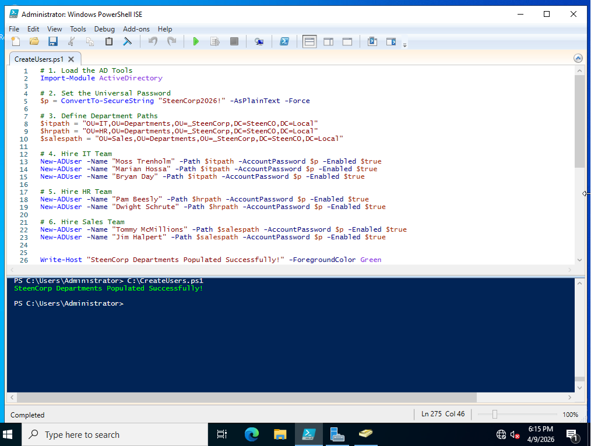

# Phase 1: Foundation & Infrastructure

## Objective
Establish a functional enterprise Active Directory environment and deploy core infrastructure components.

---

## What I Implemented
- Windows Server 2022 Domain Controller
- Windows 11 domain-joined client
- Active Directory Domain Services (AD DS)
- Organizational Unit (OU) structure
- VMware environment migration from VirtualBox

---

## Key Configurations

### Active Directory OU Structure
Designed a hierarchical OU structure to organize departments, groups, workstations, and administrative roles.

---

### Bulk User Provisioning (PowerShell)
Automated user creation using PowerShell and CSV ingestion.

---

## Validation
- Verified domain join from Windows 11 client  
- Confirmed user creation in ADUC  
- Tested authentication across domain  

---

## Outcome
Established a fully functional Active Directory environment that serves as the foundation for all future phases.
