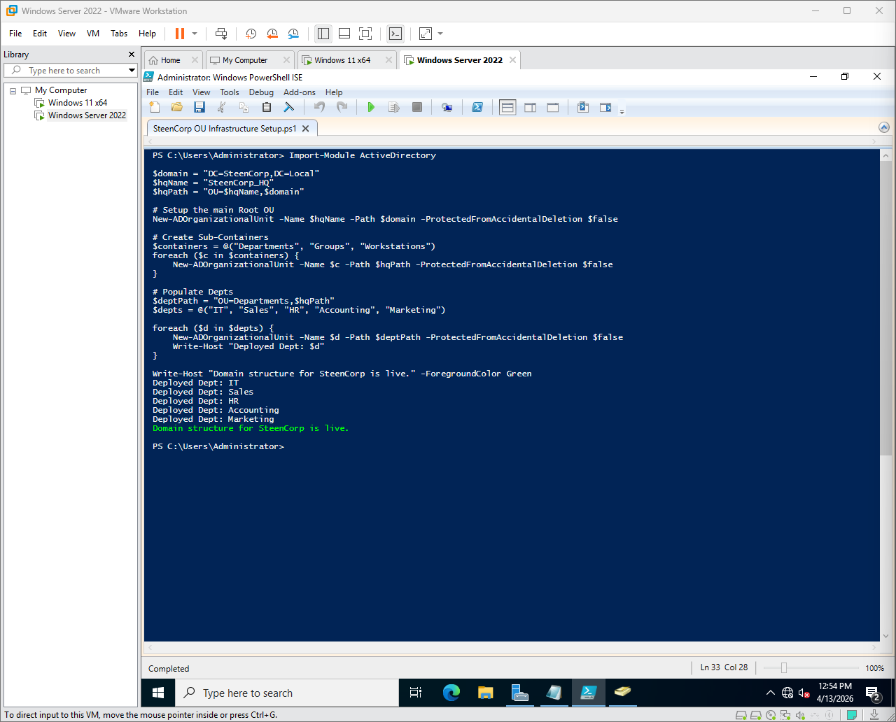

# Phase 1 – Foundation

## Objective
Set up a working Active Directory environment and build a domain structure that I could actually scale and manage, not just click through.

---

## What I Set Up

- Windows Server 2022 as the Domain Controller (DC01)
- Active Directory Domain Services (AD DS)
- Scripted Organizational Unit (OU) structure for departments, groups, and workstations

---

## Implementation

### VirtualBox Issue → Rebuild in VMware

I originally built this environment in VirtualBox, but ran into a blocking issue where my Windows 11 client VM would not boot (black screen).

After trying multiple fixes, I decided to stop wasting time troubleshooting the hypervisor and rebuilt the entire lab in VMware.

This ended up being the right call:
- More stable VM performance
- Better control over networking later in the project

---

### Domain Controller Setup (VMware)

After switching to VMware, I rebuilt the domain and promoted the server to a Domain Controller for:

`steencorp.local`

---

### OU Structure (Scripted Instead of Manual)

After switching hypervisors, I didn’t want to redo everything manually again, so I used a PowerShell script to rebuild the OU structure and make it repeatable.

This includes:
- Root OU (`SteenCorp_HQ`)
- Sub containers (Departments, Groups, Workstations)
- Department-level OUs (IT, Sales, HR, Accounting, Marketing)

This approach made the setup:
- Repeatable
- Faster to rebuild if needed
- More aligned with how larger environments are actually managed

---

## Outcome

- Domain successfully configured (`steencorp.local`)
- Domain Controller fully operational
- OU structure deployed via PowerShell
- Environment ready for user, group, and access control configuration
