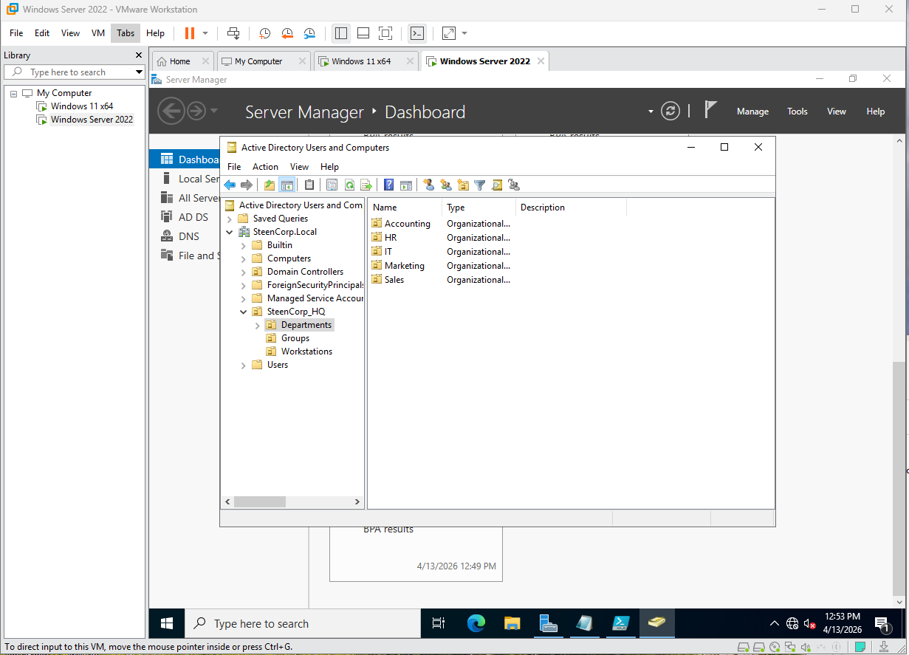

# Phase 1 – Foundation

## Objective
Set up a working Active Directory environment and establish a domain controller that I could build the rest of the lab on.

---

## What I Set Up

- Windows Server 2022 as the Domain Controller (DC01)
- Active Directory Domain Services (AD DS)
- Initial Organizational Unit (OU) structure for departments and users

---

## Implementation

### VirtualBox Issue → Rebuild in VMware

This screenshot shows me removing the original domain I built in VirtualBox.

I ran into a persistent issue where the Windows 11 client would not boot correctly (black screen), no matter what troubleshooting steps I tried. Instead of continuing to troubleshoot a broken setup, I decided to rebuild the entire environment in VMware.

This ended up being the better choice:
- More stable performance
- Better control over networking (which became important later)

---

### Domain Controller Setup (VMware)

After switching to VMware, I rebuilt the environment and installed AD DS, promoting the server to a domain controller and creating the `steencorp.local` domain.

---

### Organizational Unit Structure

Once the domain was up and running, I created a basic OU structure to organize users, departments, and workstations.

---

## Outcome

- Domain successfully configured (`steencorp.local`)
- Domain Controller fully operational
- OU structure in place for departments and users
- Stable environment ready for user, group, and access control configuration
