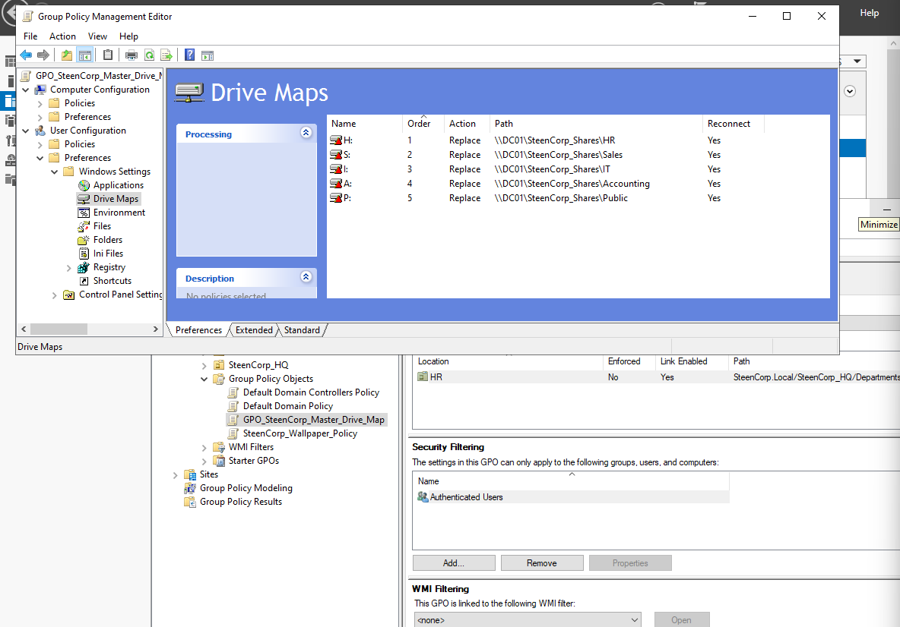

# Phase 2 – Role-Based Access Control (RBAC)

## Objective
Design and implement role-based access control (RBAC) using Active Directory security groups and validate access through mapped network drives from the client side.

---

## Implementation

### Identity & Group Design

- Created departmental security groups:
  - HR
  - IT
  - Sales
- Assigned users based on department roles
- Used group-based permissions instead of assigning access directly to users

**Why this matters:**
Group-based RBAC is scalable, easier to manage, and reflects real enterprise identity practices.

---

### Resource Design

- Created centralized file share:
  \\WIN-4CF03BHNDEC\SteenCorp_Shares

- Built department folders:
  - HR
  - IT
  - Sales

---

### Initial Drive Mapping

I initially configured a mapped drive for the Sales department using Group Policy.

- Drive: S:
- Path:
  \\WIN-4CF03BHNDEC\SteenCorp_Shares

---

## Issue Discovered During Validation

While testing from the Windows 11 client:

- Other departments did not have mapped drives
- Drive mapping behavior was inconsistent
- Some access attempts failed

---

## Root Cause

- Drive mappings were still pointing to the old server:
  \\WIN-4CF03BHNDEC\SteenCorp_Shares

- Only the HR drive was properly configured

- Additional mappings were split across multiple GPOs:
  - GPO_MAP_IT_Drive
  - GPO_MAP_Sales_Drive

This resulted in an incomplete and inconsistent RBAC implementation.

---

## Solution

I rebuilt and standardized the drive mapping configuration.

### Fixes Applied

- Updated all paths:
  \\DC01\SteenCorp_Shares

- Consolidated mappings into one GPO:
  GPO_SteenCorp_Master_Drive_Map

- Removed redundant GPOs:
  - GPO_MAP_IT_Drive
  - GPO_MAP_Sales_Drive

- Rebuilt mappings:
  - HR → H:
  - Sales → S:
  - IT → I:
  - Accounting → A:
  - Public → P:

---

## Validation & Additional Issue

After implementing the fix, I tested access from a client machine.

### Observation

- Drives were still not appearing for some users
- GPO changes were not applying as expected

I ran:
`gpupdate /force`

The command completed successfully, but the issue persisted.

---

## Root Cause (GPO Application)

The Windows 11 client machine was not placed in the correct Organizational Unit (OU).

Because of this:
- The system was not receiving the intended Group Policy Objects
- Drive mappings were not being applied

---

## Resolution

- Moved machine to:
  SteenCorp_HQ → Workstations

- Forced policy update:
  gpupdate /force

---

## Final Validation

- Group Policy applied successfully
- All mapped drives appeared correctly
- Users could access only their assigned department drives

---

## Standard User Permission Validation

Tested with:
`net session`

Result:
- System error 5 – Access is denied

---

## What I Learned

- RBAC requires proper alignment between users, groups, and resources
- Server name changes can break GPO paths
- GPO structure should be centralized to avoid inconsistency
- OU placement directly impacts policy application
- Client-side validation is critical

---

## Outcome

- Users segmented by department
- Centralized and consistent drive mapping implemented
- Group Policy functioning correctly across the domain
- Environment ready for further security enhancements
