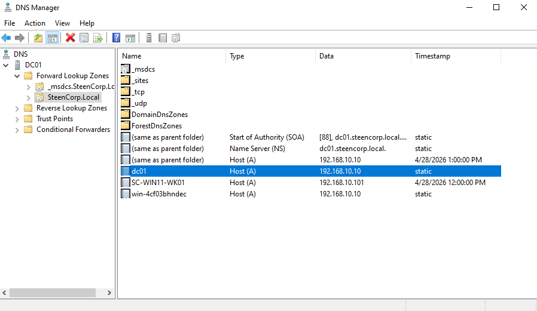
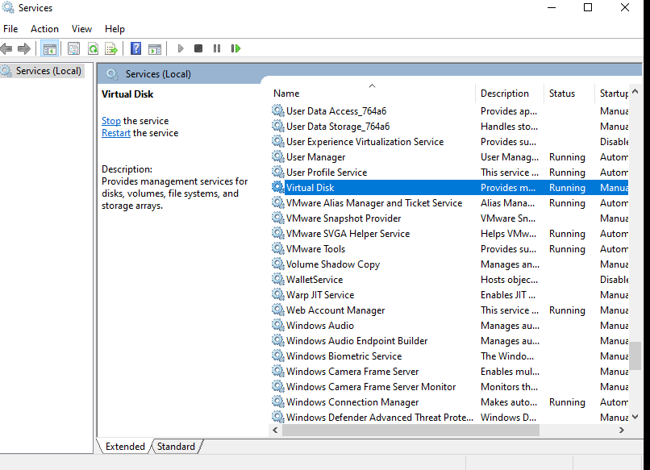

# Phase 3 – Networking & Domain Connectivity (In Progress)

## Status
🚧 In Progress

---

## Objective
Build and validate core networking functionality within the SteenCorp lab environment by establishing structured IP addressing, centralized DNS, and controlled DHCP services.

---

## Overview

Phase 3 represents the transition from isolated virtual machines into a functional enterprise network.

In this phase:
- A structured IP Address Management (IPAM) plan was designed
- The Domain Controller (DC01) was configured as the central authority
- DHCP services were implemented for dynamic client configuration
- DNS services were expanded to include forward and reverse lookup
- Real-world networking issues were encountered and resolved

This phase emphasizes not just configuration, but **troubleshooting and validation**, which are critical skills in real IT environments.

---

## SteenCorp IP Schema

A structured IP addressing plan was created before implementation:

| Category              | Range / Address        | Purpose                                  |
|----------------------|----------------------|------------------------------------------|
| Network              | 192.168.10.0/24      | Core lab subnet                          |
| Gateway              | 192.168.10.1         | Default gateway                          |
| Core Infrastructure  | 192.168.10.2–10      | Domain Controller, DNS                   |
| Server Tier          | 192.168.10.11–20     | Future servers                           |
| Static Range         | 192.168.10.21–50     | Reserved infrastructure                  |
| DHCP Range           | 192.168.10.100–200   | Client devices                           |

### Design Notes
- Static IPs ensure consistent availability for critical services
- DHCP enables scalable client configuration
- DNS is centralized on the Domain Controller
- Structured addressing prevents IP conflicts

---

## Implementation

### Domain Controller Static Configuration

---

### DHCP Deployment

---

### DNS Configuration (Forward + Reverse Lookup)

A complete DNS structure was implemented to support both forward and reverse name resolution within the SteenCorp network.

- Forward Lookup Zone: `SteenCorp.local`
- Reverse Lookup Zone: `192.168.10.0/24`

#### Reverse Lookup Zone Implementation

---

### DHCP Reservation (Controlled Addressing)

---

## Issues & Troubleshooting

### VMware DHCP Conflict

---

### DHCP Renewal Failure

---

### IP Conflict & BAD_ADDRESS Detection

---

## Resolution

- Identified VMware NAT as an external DHCP source  
- Isolated the lab using a dedicated LAN Segment  
- Eliminated competing DHCP broadcasts  
- Reconfigured client adapter for DHCP  
- Implemented DHCP reservation for consistency  

### VMware Network Isolation

---

## DNS Implementation & Troubleshooting

### DNS Manager State

During DNS configuration, records and zones were reviewed to ensure proper structure and identify inconsistencies.

---

### DNS Forwarders (External Resolution)

To enable external domain resolution, DNS forwarders were configured on the Domain Controller.

- 8.8.8.8 (Google DNS)  
- 1.1.1.1 (Cloudflare DNS)  

---

### DNS Service Troubleshooting

During testing, DNS resolution issues required service-level troubleshooting.

---

### DNS Cache Reset & Record Re-Registration

Commands used:

`Stop-Service DNS`  
`ipconfig /flushdns`  
`Start-Service DNS`  
`ipconfig /registerdns`

---

### DNS Validation (Forward & Reverse Lookup)

Commands used:

`nslookup dc01`  
`nslookup 192.168.10.10`

---

## Validation (Current State)

### Final Network State Verification

- IP Address: 192.168.10.101  
- DHCP Server: 192.168.10.10  
- DNS Server: 192.168.10.10  
- Gateway: 192.168.10.1  

---

## Key Takeaways

- Proper IP planning is critical before deployment  
- Virtual environments can introduce hidden network conflicts  
- DHCP and DNS must be tightly controlled in enterprise environments  
- Troubleshooting is as important as initial configuration  
- Network isolation is essential for lab accuracy and stability  

---

## Next Steps (Planned)

- DNS Forwarders validation refinement  
- Routing table analysis (`route print`)  
- Network path verification (`tracert`)  
- ARP table validation (`arp -a`)  
- Recursive vs Iterative DNS concepts 
