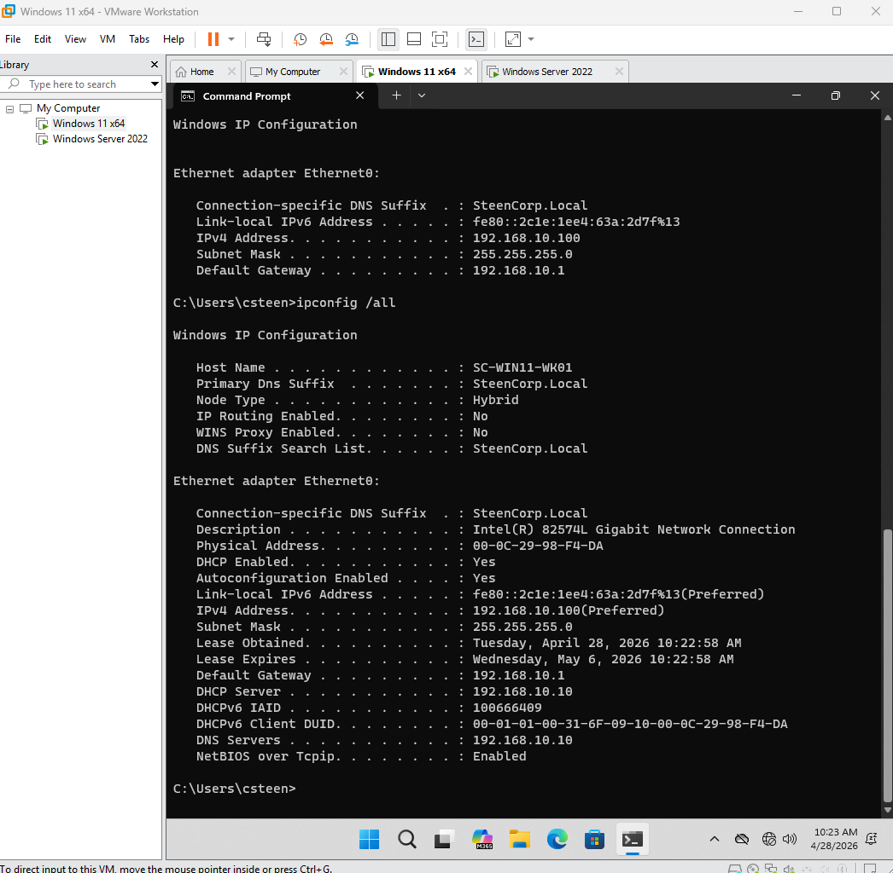

# Phase 3 – Networking & Domain Connectivity (In Progress)

## Status
🚧 In Progress

---

## Objective
Build and validate core networking functionality within the SteenCorp lab environment by establishing structured IP addressing, centralized DNS, and controlled DHCP services.

---

## Overview

Phase 3 represents the transition from isolated virtual machines into a functional enterprise network.

In this phase:
- A structured IP Address Management (IPAM) plan was designed
- The Domain Controller (DC01) was configured as the central authority
- DHCP services were implemented for dynamic client configuration
- Real-world networking issues were encountered and resolved

This phase emphasizes not just configuration, but **troubleshooting and validation**, which are critical skills in real IT environments.

---

## SteenCorp IP Schema

A structured IP addressing plan was created before implementation:

| Category              | Range / Address        | Purpose                                  |
|----------------------|----------------------|------------------------------------------|
| Network              | 192.168.10.0/24      | Core lab subnet                          |
| Gateway              | 192.168.10.1         | Default gateway                          |
| Core Infrastructure  | 192.168.10.2–10      | Domain Controller, DNS                   |
| Server Tier          | 192.168.10.11–20     | Future servers                           |
| Static Range         | 192.168.10.21–50     | Reserved infrastructure                  |
| DHCP Range           | 192.168.10.100–200   | Client devices                           |

### Design Notes
- Static IPs ensure consistent availability for critical services
- DHCP enables scalable client configuration
- DNS is centralized on the Domain Controller
- Structured addressing prevents IP conflicts

---

## Implementation

### Domain Controller Static Configuration

The Domain Controller (DC01) was assigned a static IP address to act as a stable and reliable network anchor.

---

### DHCP Deployment

A DHCP scope was configured to dynamically assign IP addresses to client machines while protecting infrastructure ranges through exclusions.

---

## Issues & Troubleshooting

### VMware DHCP Conflict

During initial testing, the client machine received an incorrect IP address from VMware’s internal DHCP service (192.168.217.x range), instead of the intended SteenCorp network.

This resulted in:
- Incorrect subnet assignment
- Improper DNS configuration
- Failed communication with the Domain Controller

---

### DHCP Renewal Failure

An attempt to renew the IP configuration failed because the client adapter was still configured with a static IP.

This prevented DHCP from issuing a valid lease.

---

### Resolution

The issue was resolved by:
- Disabling VMware DHCP interference
- Reconfiguring the client network adapter to use DHCP
- Renewing the IP lease from the Domain Controller

---

## Validation (Current State)

### Successful DHCP Assignment

After resolving configuration conflicts, the client successfully received a valid IP configuration from the Domain Controller.

Key validation points:
- IP Address assigned within DHCP scope
- DHCP Server = DC01 (192.168.10.10)
- DNS Server = DC01
- Correct subnet and gateway assignment

---

## Key Takeaways

- Proper IP planning is essential before deployment
- Virtual environments can introduce unexpected DHCP conflicts
- Static vs dynamic configurations must be carefully managed
- Troubleshooting is a core networking skill

---

## Next Steps (Planned)

The following enhancements are planned to further develop Phase 3:

- DNS Forwarding configuration and external resolution testing
- Routing table analysis and default gateway validation
- Network path verification using tracert
- DHCP Reservations for controlled client addressing

Additional validation and evidence will be added as these components are implemented.
