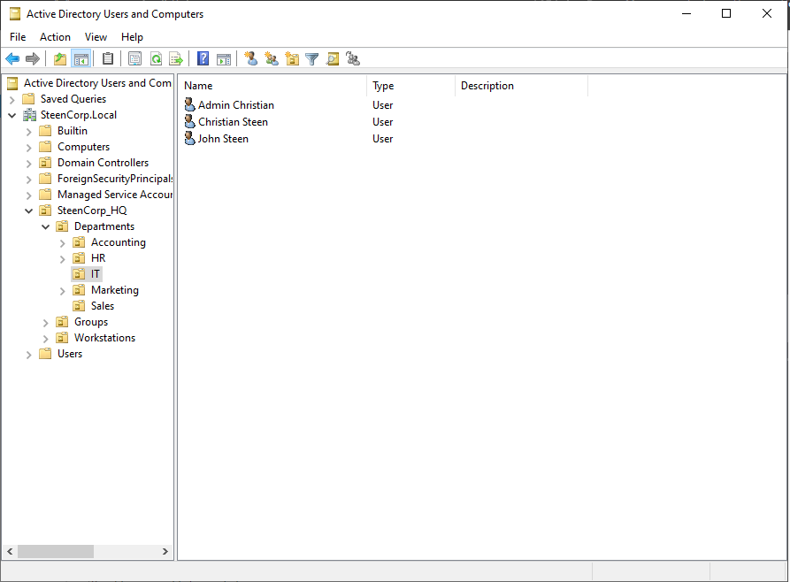
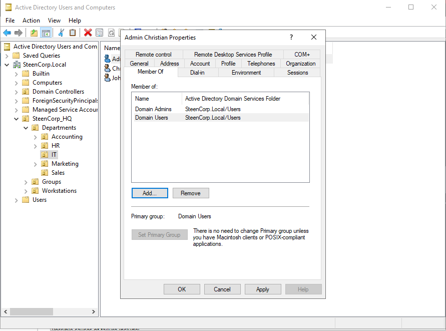
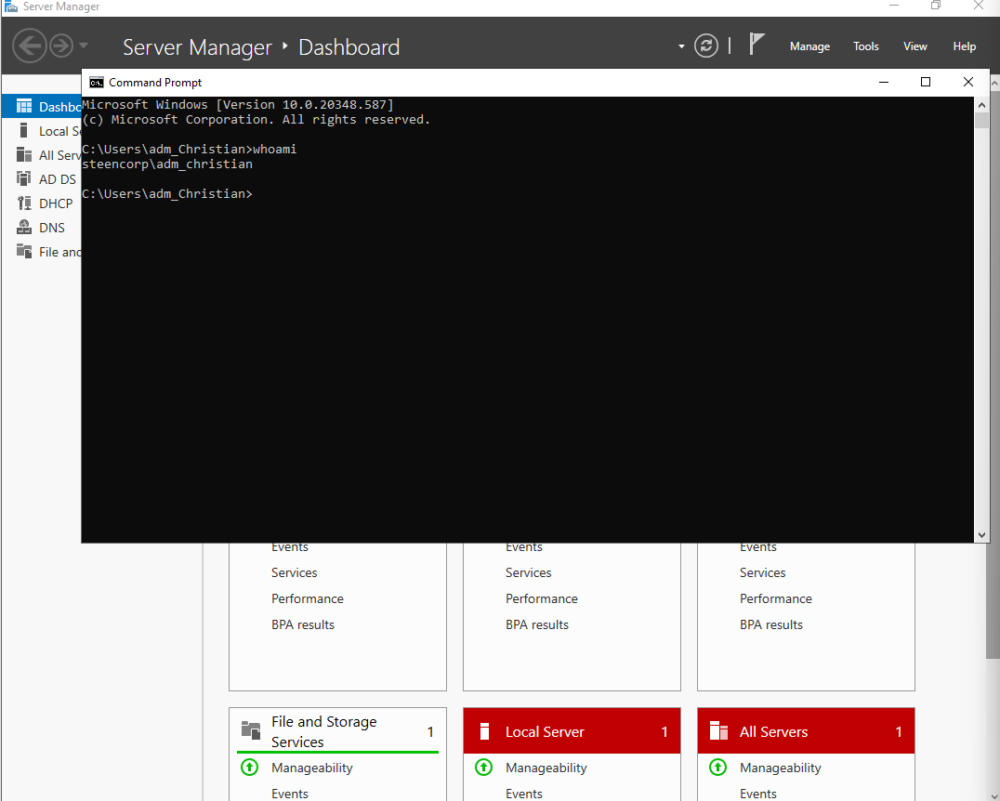
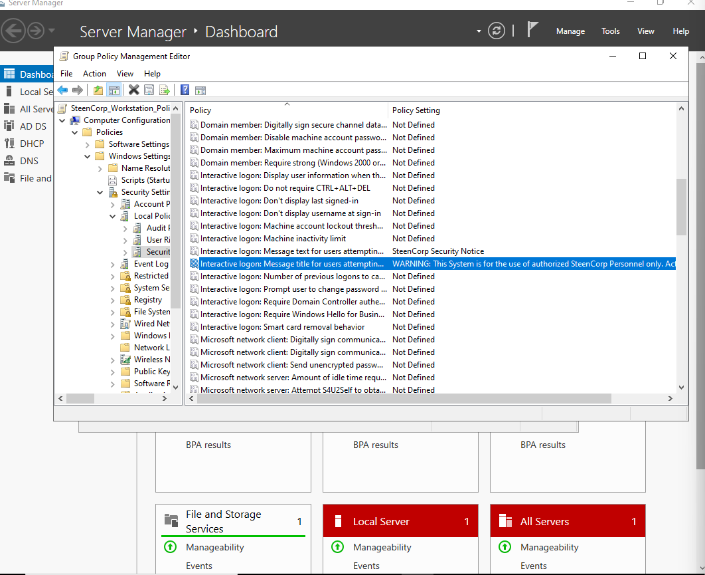
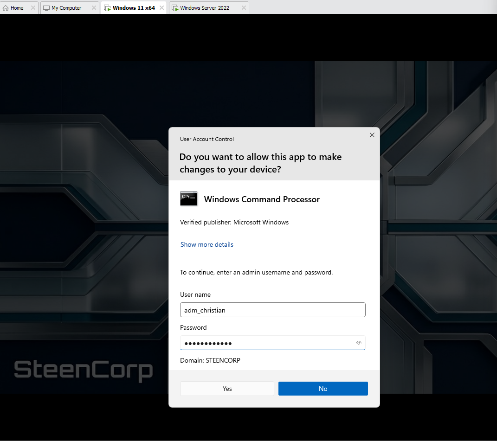
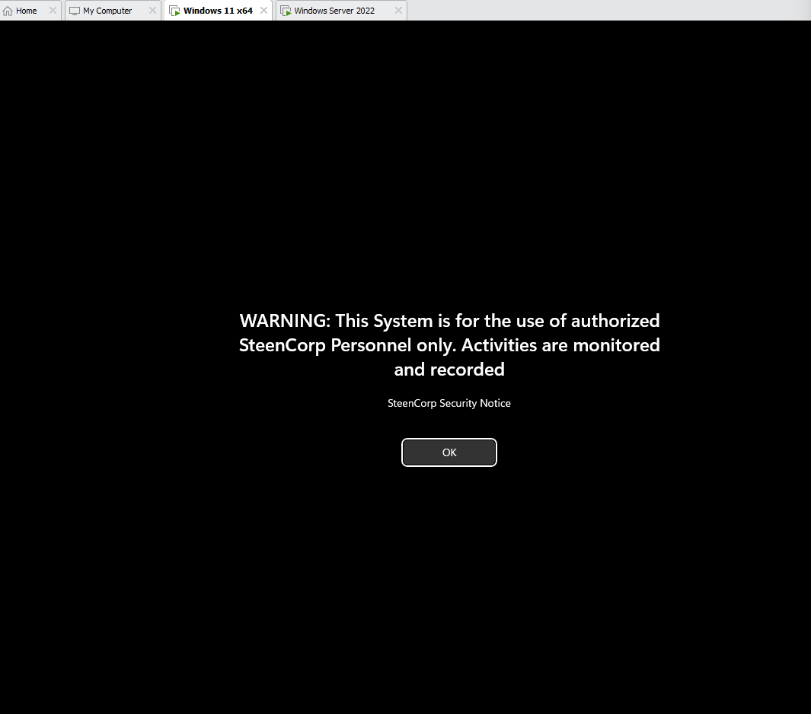
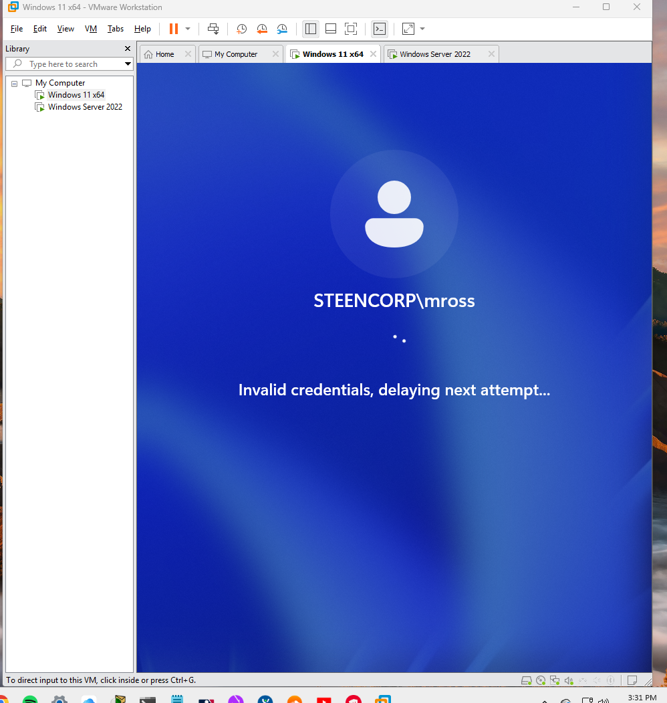
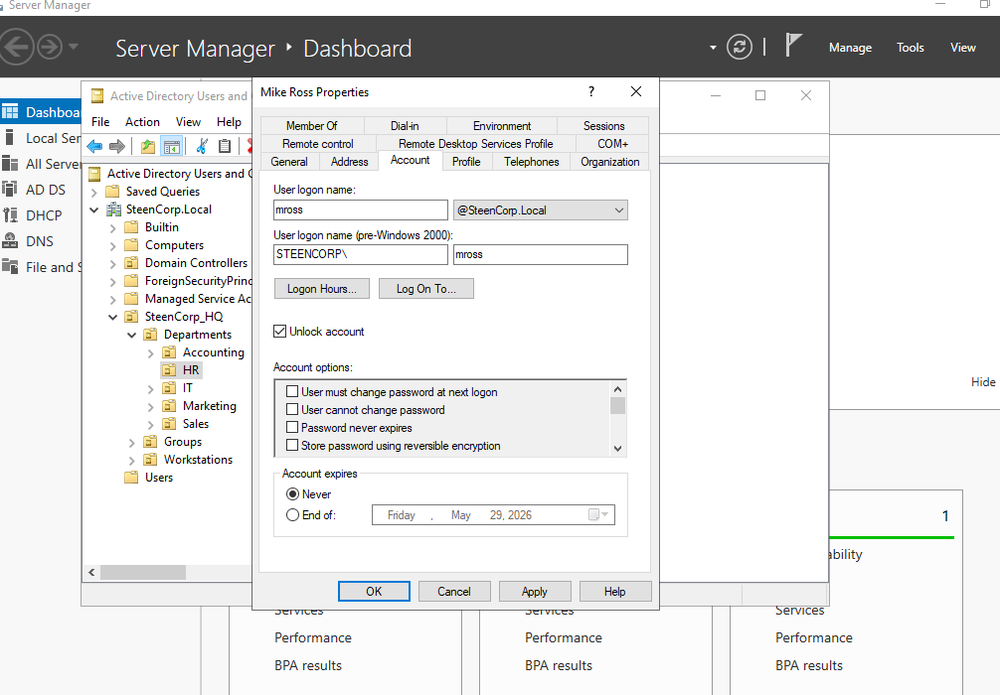
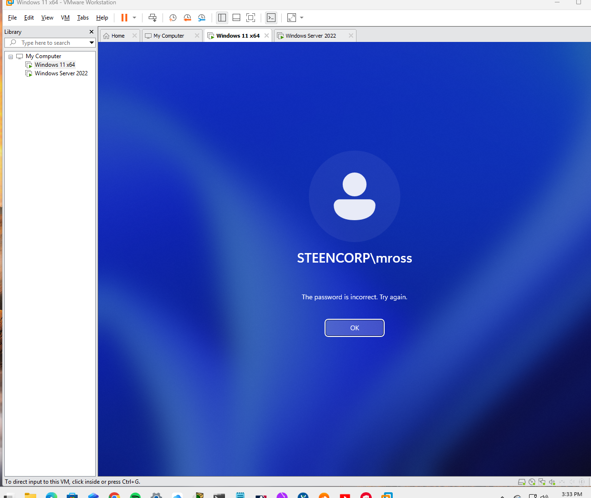

# Phase 4 – Security & Enterprise Controls

---

## Objective
Implement enterprise-level security practices within the SteenCorp environment by introducing privileged identity management, workstation hardening through Group Policy, and automated network configuration using DHCP.

---

## Overview

Phase 4 focuses on securing and operationalizing the environment after core infrastructure, access control, and networking have been established.

In this phase, I:
- Implemented a dedicated administrative account following best practices
- Applied workstation security policies using Group Policy
- Deployed and validated DHCP for automated network configuration
- Tested security enforcement from the end-user perspective

This phase represents the transition from a functional environment to a secure and manageable enterprise system.

---
## A. Professional Identity Management (Tiered Admin)

### Implementation

To follow enterprise security best practices, I created a dedicated administrative account instead of using the default Administrator account.

- Created new user:
  adm_christian

- Placed account in:
  Domain Admins

- Stored within:
  SteenCorp_HQ → IT OU

---

### Why This Matters

- Default Administrator accounts are common attack targets
- Named admin accounts provide accountability and auditing
- Supports least privilege and real-world enterprise practices

---

### Validation

I verified the configuration by:

- Confirming the account exists in Active Directory
- Verifying Domain Admins group membership
- Logging into the domain using the new admin account

---

### Evidence

#### Admin Account Created in ADUC

#### Domain Admins Group Membership

#### Logged in as Admin Account

---

## B. Workstation Security Hardening (Group Policy)

### Objective
Implement security-focused Group Policy settings to harden domain-joined workstations and enforce controlled user behavior.

---

## Security Controls Implemented

### Account Lockout Policy

Configured to prevent brute-force login attempts:

- Lockout threshold: 5 invalid attempts
- Locks user account after repeated failures

---
### GPO Configuration

Configured within:

Computer Configuration → Policies → Windows Settings → Security Settings → Local Policies → Security Options

---
### Privilege Enforcement (UAC)

Used the dedicated admin account (adm_christian) to run elevated commands and force a Group Policy update.

---

### Login Banner (Legal Notice)

Implemented a security warning displayed before user login.

- Title: SteenCorp Security Notice
- Message:
  WARNING: This system is for the use of authorized SteenCorp Personnel only. Activities are monitored and recorded.

---

### Screen Lock Policy

Configured automatic workstation locking:

- Timeout: 300 seconds (5 minutes)
- Password required on resume

---

## Validation & Testing

### Account Lockout & Recovery Workflow

Simulated multiple failed login attempts from a standard user account to validate enforcement of the account lockout policy.

After 5 incorrect password entries, the account was automatically locked as configured.

---

### Administrative Intervention

Used a privileged admin account to unlock the affected user account within Active Directory.

---
### Access Restoration

After administrative unlock, the user successfully regained access to the system.

---

## What This Demonstrates

- Enforcement of account lockout policies
- Protection against brute-force login attempts
- Use of login banners for legal/security notice
- Separation of standard user and administrative privileges
- Real-world troubleshooting workflow (lockout → admin intervention → recovery)

---

## Outcome

- Workstations hardened through Group Policy
- User authentication behavior controlled and monitored
- Administrative actions secured through credential separation
- Security policies validated through real client-side testing
---
## Final Validation

- Administrative access is secured and auditable
- Workstation policies are enforced
- Security controls validated from client perspective

---

## What I Learned

- Default admin accounts should not be used in production
- GPO is critical for enforcing security at scale
- Security must be layered on top of functionality
- Validation from the user perspective is essential

---

## Outcome

- Secure administrative access model implemented
- Workstation security policies enforced via GPO
- Environment aligned with enterprise security practices
