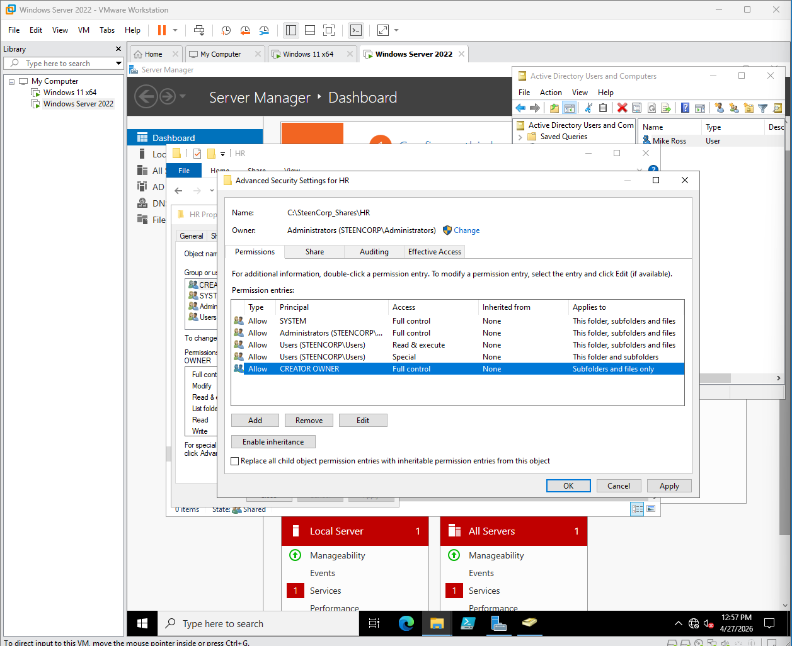
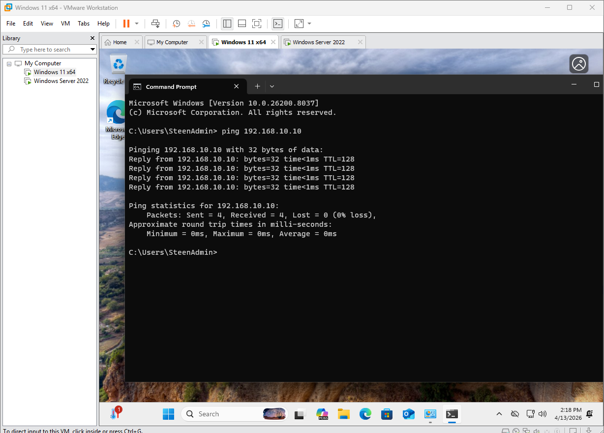
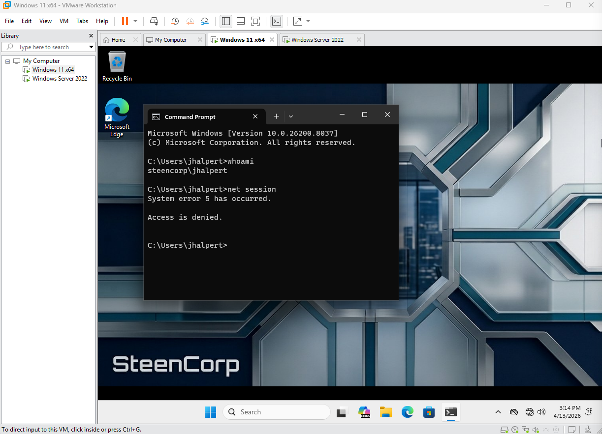

# SteenCorp Enterprise Infrastructure Lab

## Overview
Built a simulated enterprise Active Directory environment using Windows Server 2022 and VMware. This project demonstrates user provisioning, organizational design, automation with PowerShell, and system validation from a domain-joined client.

---

## Environment
- Windows Server 2022 (Domain Controller)
- Windows 11 Pro (Domain Joined)
- VMware Workstation

---

## What I Built
- Designed and implemented Active Directory OU structure (Departments, Groups, Workstations, Admins)
- Automated user creation and group assignment using PowerShell scripts and CSV ingestion
- Configured security groups to simulate role-based access control (RBAC)
- Engineered a centralized file infrastructure with departmental security silos
- Deployed Group Policy Objects (GPOs) for configuration enforcement and resource mapping
- Joined Windows 11 client to domain and validated authentication and permissions

---

## Major Challenge: VirtualBox Failure → VMware Migration

Initially built the lab in VirtualBox but encountered Windows 11 display driver issues (black screen).  

**Action:**
- Demoted original Domain Controller  
- Rebuilt entire environment in VMware  

**Result:**
- Improved performance, stability, and network reliability  

View Migration Evidence

---

## Automation (PowerShell)

Used a script-first approach to simulate real-world onboarding and scalability.

### Key Scripts

- [OU Infrastructure Setup](./Scripts/SteenCorp%20OU%20Infrastructure%20Setup.ps1)  
  → Builds the full Organizational Unit structure  

- [Security Group Deployment](./Scripts/SteenCorp%20Group%20Infrastructure.ps1)  
  → Creates and organizes all departmental security groups  

- [Employee CSV Generator](./Scripts/Create%20Mega%20SteenCorp%20Employee%20CSV.ps1)  
  → Generates large-scale test data  

- [Bulk User Provisioning](./Scripts/SteenCorp%20Final%20Bulk%20Ingestion.ps1)  
  → Creates users, assigns OUs, and applies group membership  

---

### What This Demonstrates
- Infrastructure as Code (IaC) mindset  
- Scalable onboarding process  
- Automated RBAC implementation  
- Reduced manual administrative effort  

View Automation & AD Architecture

---

## Phase 2: RBAC & GPO Implementation

Built a centralized file and access control system using RBAC and Group Policy.

### Key Achievements
- Created centralized share: `SteenCorp_Shares`
- Implemented department-based access (HR, IT, Sales)
- Used NTFS permissions to enforce data isolation
- Disabled inheritance to prevent cross-department access
- Deployed GPOs to automatically map drives per department

---

View Resource & Policy Configuration

| Task | Evidence |
| :--- | :--- |
| Directory Structure |  |
| Share Permissions |  |
| NTFS Security |  |
| GPO Linking |  |
| Drive Mapping |  |

---

## Validation & Testing

Performed baseline validation from a client perspective:

- Verified network connectivity (ICMP / ping)
- Confirmed domain join
- Checked user placement and group membership
- Tested basic access controls

View Validation Evidence

---

## Final Result (Full Environment Proof)

Validated full enterprise functionality including authentication, policy enforcement, and access control.

### Multi-Department Access Validation

Verification of **Mike Ross (HR)** receiving the correct mapped drive and permissions.

- Identity confirmed via `whoami`
- Policy application verified via `gpresult /r`
- Department isolation successfully enforced

---

### Final System State

- GPO applied successfully
- Corporate branding enforced
- Standard users restricted from administrative actions

---

## Key Takeaways

- Rebuilding environments is often faster than troubleshooting broken infrastructure  
- PowerShell automation enables scalable system administration  
- RBAC simplifies access management in enterprise environments  
- Validation from the end-user perspective is critical  

---

## Future Roadmap

**Phase 3:** Security Monitoring (Sysmon + Event Analysis)  
**Phase 4:** Remote Access (VPN + Routing)  
