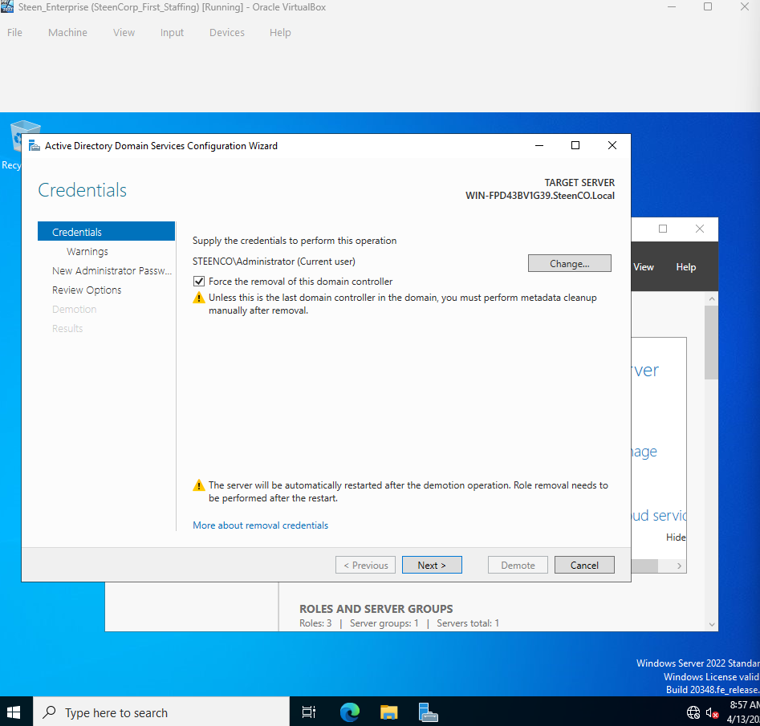
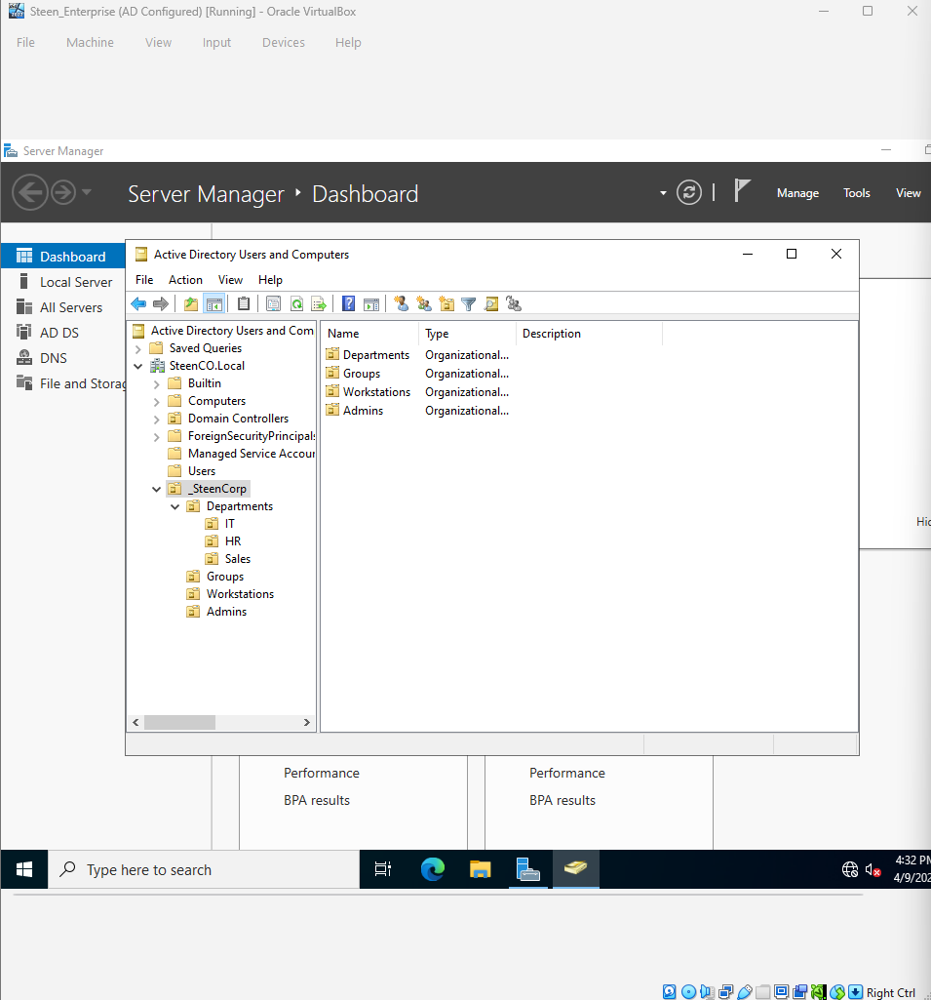
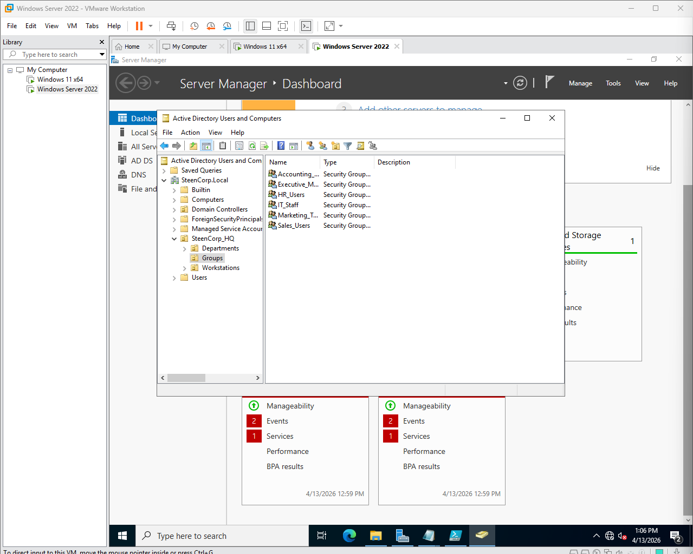
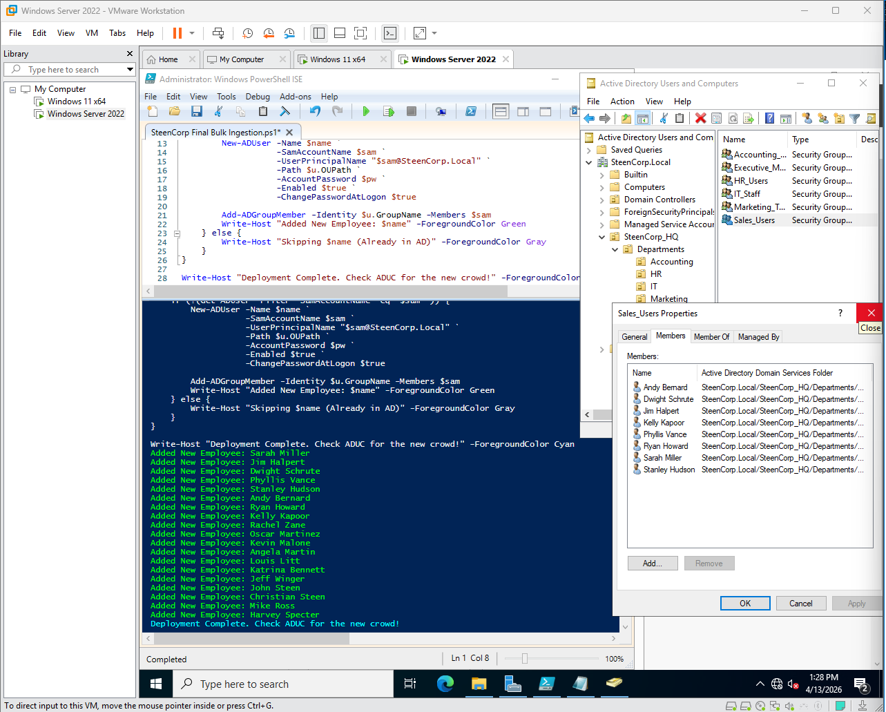
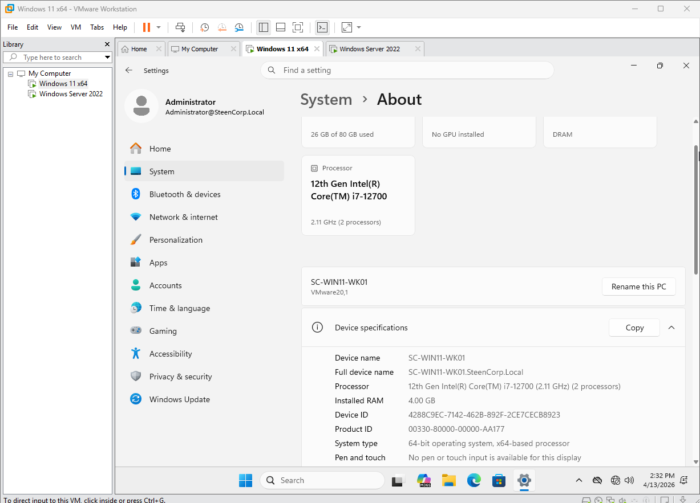
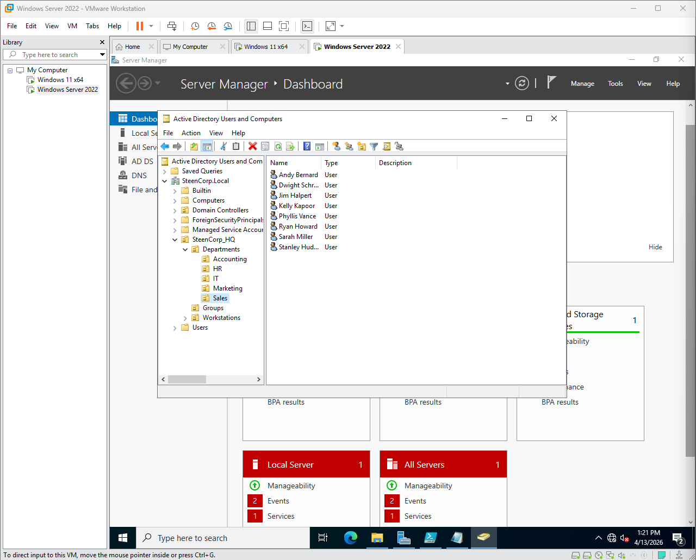

# SteenCorp Enterprise Infrastructure Lab

## Project Overview
The **SteenCorp** project is a comprehensive, virtualized Windows Enterprise environment. This lab serves as a functional proof-of-concept for core system administration tasks, including identity management, platform migration, and high-scale automated provisioning via PowerShell.

## Phase 1: Foundation & Platform Migration

### The Technical Pivot: VirtualBox to VMware
The project initially launched in Oracle VirtualBox. However, during the provisioning of the Windows 11 client, I encountered persistent display driver failures (Black Screen of Death).

* **Action:** Performed a demotion of the original Domain Controller and migrated the entire infrastructure to **VMware Workstation**.
* **Outcome:** Successfully re-established the `SteenCorp.Local` forest with improved hardware acceleration and network stability.

  
 View Migration Evidence

  
  *Initial VirtualBox display failure that triggered the platform migration.*

  
  *Forced demotion of the initial DC to ensure a clean migration and forest rebuild on VMware.*

---

##  Infrastructure as Code (PowerShell Automation)
To ensure the environment was scalable and repeatable, I utilized a "Script-First" approach to provision the entire domain.

**Featured Scripts:**
* [SteenCorp OU Infrastructure Setup.ps1](Scripts/SteenCorp%20OU%20Infrastructure%20Setup.ps1) - Automates the creation of the SteenCorp_HQ root and sub-OU hierarchy.
* [SteenCorp Group Infrastructure.ps1](Scripts/SteenCorp%20Group%20Infrastructure.ps1) - Deploys all departmental security groups for RBAC.
* [Create Mega SteenCorp Employee CSV.ps1](Scripts/Create%20Mega%20SteenCorp%20Employee%20CSV.ps1) - Generates the expanded employee dataset for large-scale testing.
* [SteenCorp Final Bulk Ingestion.ps1](Scripts/SteenCorp%20Final%20Bulk%20Ingestion.ps1) - The master script that ingests CSV data to create user objects and assign group memberships.

  
 View Automation & AD Architecture

  
  *The logical Organizational Unit hierarchy designed for SteenCorp HQ.*

  
  *Provisioning departmental security groups to manage resource access.*

  
  *The Bulk Ingestion script in action, populating the domain in seconds.*

---

## Network & Domain Validation
Once the directory was live, I performed a "Handshake Validation" to ensure the network stack was resilient and the client integration was complete.

* **Connectivity:** Configured static IP addressing and verified ICMP handshakes.
* **Domain Integration:** Successfully performed a Domain Join for `SC-WIN11-WK01`.
* **Identity Audit:** Performed a departmental audit to ensure all automated users were correctly placed.

  
 View Network & Verification Evidence

  
  *Verified Layer 3 connectivity between the workstation and the Domain Controller.*

  
  *Official domain join status for the Windows 11 client.*

  
  *Confirmed the Sales department is fully populated with the correct user objects.*

  
  *Final audit of the automated user ingestion across departmental OUs.*

---

## Final Operational Success (GPO Deployment)
Phase 1 concluded with the successful application of **Group Policy Objects (GPOs)** to enforce corporate branding and security baselines.

* **Branding:** Deployed the "SteenCorp" corporate wallpaper across the domain.
* **Security:** Verified that standard users (e.g., `jhalpert`) were restricted from administrative system changes.

*Successful login for `steencorp\jhalpert` with GPO-enforced wallpaper and security restrictions active.*

---

## Future Roadmap
* **Phase 2:** Automated Resource Management (Mapped Drives & Software Deployment).
* **Phase 3:** Security Operations (Sysmon Deployment & Event Log Analysis).
* **Phase 4:** Remote Access Infrastructure (VPN Configuration & Routing).
