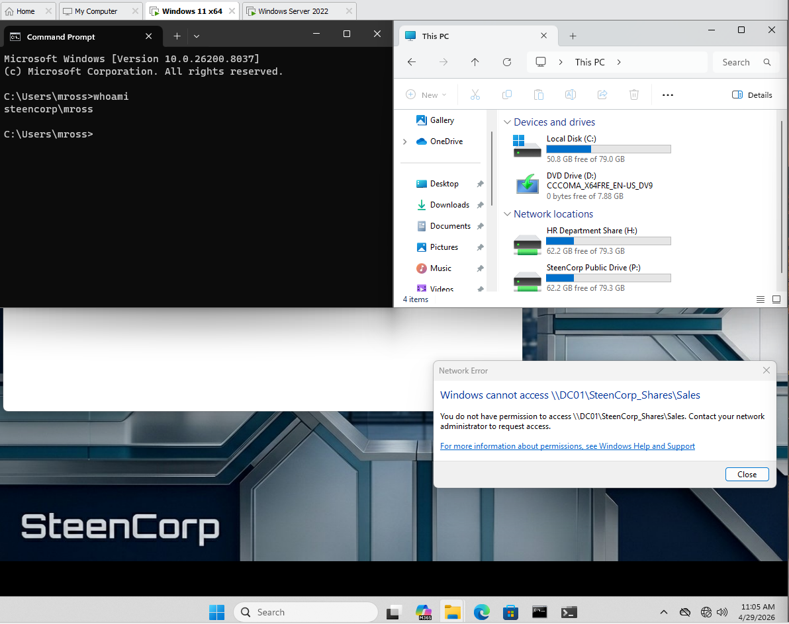
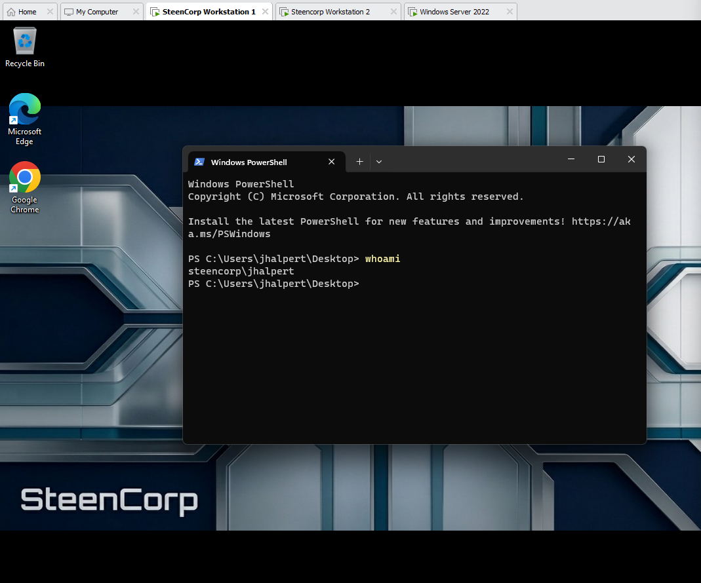

# SteenCorp Enterprise IT Lab

## Overview

The SteenCorp Enterprise IT Lab is a simulated business IT environment designed to bridge the gap between certification knowledge and practical, hands-on experience to replicate real-world scenarios, including:

- Active Directory Domain Services (AD DS)
- Organizational Unit (OU) design
- Group Policy (GPO) configuration and troubleshooting
- Role-Based Access Control (RBAC)
- Mapped network drives and department-based permissions
- Group Policy software deployment
- DHCP and DNS configuration
- IP addressing and network troubleshooting
- Enterprise identity and access management
- Account lockout and workstation security policies
- Standard user and administrative account separation
- Real-world issue diagnosis and resolution

### Lab Design Philosophy

The environment was built as a reusable domain infrastructure rather than a one-time lab.

This allows additional scenarios to be layered on top of the same system to reflect how real enterprise environments are continuously developed, maintained, troubleshot, and improved over time.

### What I Learned

- Building systems is only one part of IT; troubleshooting and validation are just as important
- Active Directory structure affects how policies and access controls behave
- Group Policy depends heavily on proper OU placement, targeting, and refresh behavior
- RBAC is easier to manage when permissions are assigned to groups instead of individual users
- Software deployment through GPO requires proper UNC paths, share permissions, and computer-scope validation
- Virtual environments can introduce real-world networking issues
- DNS is critical in Active Directory environments
- Security controls must be implemented and validated, not assumed
- A reusable lab environment can support multiple future projects and troubleshooting scenarios
- A later help desk ticket can expose infrastructure design gaps, and documenting those changes shows how real environments evolve after troubleshooting

---

## Related Portfolio Projects

| Project | Focus |
|---|---|
| [SteenDesk Help Desk Simulation](https://github.com/CSteen57/SteenDesk_Help_Desk_Simulation) | Help desk troubleshooting, ticket documentation, Active Directory account issues, DNS troubleshooting, software install support, and least privilege validation |
| [SteenCorp Network Segmentation Lab](https://github.com/CSteen57/SteenCorp_Network_Segmentation_Lab) | VLAN segmentation, trunking, router-on-a-stick, ACL-based guest isolation, and network validation |

---

## Project Roadmap

| Phase | Status | Focus | Outcome |
|---|---|---|---|
| Phase 1: Foundation | Completed | Domain setup, AD DS, virtualization | Built a fully functional Windows domain environment |
| Phase 2: Access Control, GPO & Software Deployment | Completed | RBAC, drive mapping, GPO troubleshooting, Chrome deployment | Implemented access control and centralized workstation software deployment |
| Phase 3: Networking & Troubleshooting | Completed | DNS, DHCP, IP management, issue resolution | Configured and validated core network services |
| Phase 4: Security & Enterprise Controls | Completed | Identity management, GPO security, workstation hardening | Implemented enterprise-level security controls and validation |

This lab was later extended into separate portfolio projects using the same SteenCorp business environment.

---

## Architecture/Environment Summary

| Component | Details |
|---|---|
| Domain | `steencorp.local` |
| Domain Controller | Windows Server 2022 |
| Domain Controller Hostname | `DC01` |
| Client Systems | Windows 11 domain-joined workstations |
| Virtualization Platform | VMware Workstation |
| Original Network Type | Internal VMware LAN segment |
| Current Network Type | VMware NAT-backed `VMnet8` |
| Lab Subnet | `192.168.10.0/24` |
| Current NAT Gateway | `192.168.10.2` |
| Core Services | AD DS, DNS, DHCP, Group Policy, File Sharing |

---

## Key Highlights

### Centralized Identity & Access Control

- Built a structured Active Directory environment
- Created department-based Organizational Units and security groups
- Implemented RBAC using group-based permissions
- Restricted users to only their assigned department resources
- Validated access from domain-joined Windows 11 clients

### Group Policy Management

- Configured mapped network drives through Group Policy
- Consolidated drive mappings into a centralized GPO
- Resolved GPO issues caused by incorrect OU placement
- Validated policy application using client-side testing
- Expanded Group Policy use beyond access control into software deployment and workstation security

### Software Deployment

- Created a centralized software repository on DC01
- Configured NTFS and share permissions for deployment access
- Deployed Google Chrome using Group Policy software installation
- Used a UNC path for MSI deployment
- Verified Chrome installation across multiple domain users

### Networking & Troubleshooting

- Configured DNS and DHCP services for the lab domain
- Planned and validated IP addressing for the internal network
- Resolved DHCP conflicts caused by VMware NAT interference
- Diagnosed incorrect IP assignments and `BAD_ADDRESS` conflicts
- Validated DNS resolution and DHCP assignment from Windows clients
- Used command-line tools to test connectivity and name resolution
- Later updated the lab network after a help desk ticket exposed missing internet routing from the isolated LAN Segment
- Reconfigured the environment to use VMware NAT-backed `VMnet8` while keeping DC01 as the DHCP and DNS server
- Updated the active client default gateway from the original planned gateway `192.168.10.1` to the validated VMware NAT gateway `192.168.10.2`

### Security Implementation

- Created a dedicated administrative account
- Validated separation between standard and administrative users
- Enforced account lockout policy
- Configured a login security banner
- Applied workstation hardening through Group Policy
- Validated security controls from the client side

### Real-World Troubleshooting

This lab includes troubleshooting scenarios that mirror issues commonly seen in business IT environments, including:

- GPO deployment problems caused by incorrect OU placement
- Drive mapping issues caused by targeting and path configuration
- DHCP conflicts caused by virtualization network settings
- DNS resolution inconsistencies
- Software deployment issues involving UNC paths, share permissions, and computer-scope policy application
- Account lockout behavior and administrative recovery

---
### Post-Build Infrastructure Update

The original Phase 3 network design used an isolated VMware LAN Segment so DC01 could act as the controlled DHCP and DNS source for the SteenCorp domain.

During the later SteenDesk Help Desk Simulation, Ticket #006 revealed that domain clients could reach internal resources and resolve external DNS names, but could not access the internet. The issue was traced to the isolated LAN Segment lacking a working NAT/default gateway path.

To resolve the issue, the lab network was updated to use VMware NAT-backed `VMnet8` on the same `192.168.10.0/24` subnet. VMware DHCP remained disabled so DC01 continued providing DHCP and DNS. The actual VMware NAT gateway was confirmed as `192.168.10.2`, so DHCP Scope Option 003 Router was updated accordingly.

This preserved the original SteenCorp subnet, domain controller IP, DHCP range, and DNS design while adding working internet access for domain clients.

Updated network state:

| Setting | Original Phase 3 Design | Post-Ticket #006 Update |
|---|---|---|
| Subnet | `192.168.10.0/24` | `192.168.10.0/24` |
| DC01 IP | `192.168.10.10` | `192.168.10.10` |
| DHCP Server | `192.168.10.10` | `192.168.10.10` |
| DNS Server | `192.168.10.10` | `192.168.10.10` |
| Default Gateway | `192.168.10.1` | `192.168.10.2` |
| VMware Network | Internal LAN Segment | NAT-backed `VMnet8` |
| VMware DHCP | Disabled | Disabled |

---

## Sample Validation

### RBAC Enforcement

Users can only access their assigned department drives.

---

### Software Deployment

Google Chrome was deployed through Group Policy and validated across domain users.

---

### Network Validation

DHCP and DNS configuration were validated from the client workstation.

---

### Security Enforcement

Account lockout policy was triggered and resolved through administrative intervention.

