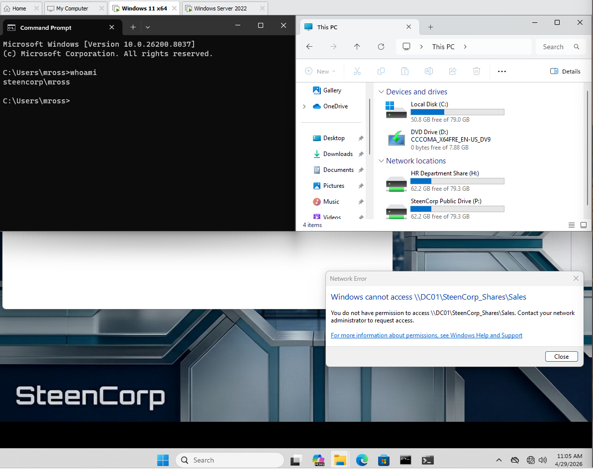
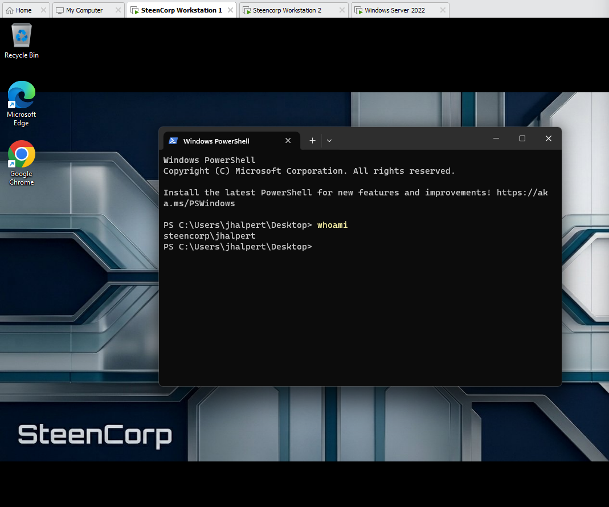
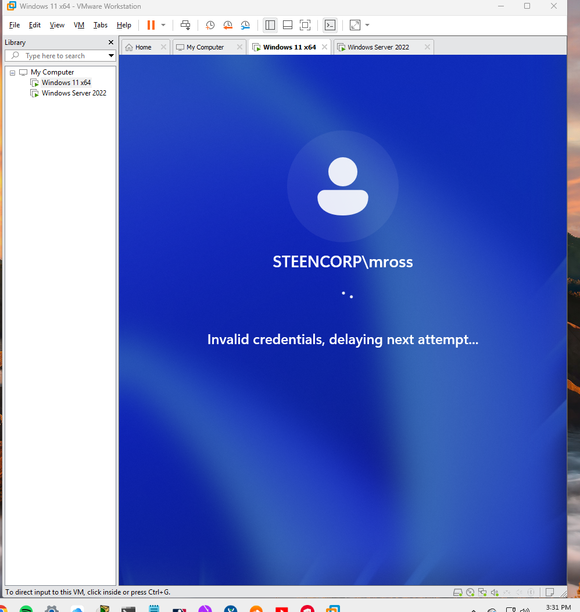

# SteenCorp Enterprise IT Lab

## Overview

The SteenCorp Enterprise IT Lab is a simulated business IT environment designed to bridge the gap between certification knowledge and hands-on administration, troubleshooting, and validation.

The project includes:

- Active Directory Domain Services and Organizational Unit design
- PowerShell infrastructure and identity lifecycle automation
- Group Policy configuration and troubleshooting
- Role-Based Access Control using security groups
- Mapped network drives and department-based permissions
- Centralized software deployment through Group Policy
- DHCP, DNS, IP addressing, and network troubleshooting
- Account lockout and workstation security policies
- Standard user and administrative account separation
- Real-world issue diagnosis, resolution, and documentation

### Lab Design Philosophy

The environment was built as reusable domain infrastructure rather than a one-time lab.

This allows new administration, support, security, networking, and automation scenarios to be layered onto the same environment. That approach reflects how business IT systems are continuously maintained, troubleshot, secured, and improved over time.

---

## Related Portfolio Project

| Project | Focus |
|---|---|
| [SteenDesk Help Desk Simulation](https://github.com/CSteen57/SteenDesk_Help_Desk_Simulation) | Help desk troubleshooting, ticket documentation, Active Directory account issues, DNS troubleshooting, software installation support, and least privilege validation |

---

## Project Roadmap

| Phase | Status | Focus | Outcome |
|---|---|---|---|
| [Phase 1: Foundation and Environment Setup](./Phases/Phase%201/) | Completed | Domain setup, AD DS, virtualization, and PowerShell | Built a functional Windows domain with automated infrastructure and user provisioning |
| [Phase 2: Access Control, Group Policy, and Software Deployment](./Phases/Phase%202/) | Completed | RBAC, drive mapping, Group Policy, and Chrome deployment | Implemented group-based access control and centralized workstation software deployment |
| [Phase 3: Networking and Domain Connectivity](./Phases/Phase%203/) | Completed | DNS, DHCP, IP management, and connectivity troubleshooting | Configured, validated, and improved the lab’s core network services |
| [Phase 4: Security and Enterprise Controls](./Phases/Phase%204/) | Completed | Administrative separation, account security, and workstation hardening | Implemented centralized account and workstation security controls with client-side validation |
| [Phase 5: PowerShell Identity Lifecycle Automation](./Phases/Phase%205/) | In Progress | Employee onboarding, validation, and lifecycle automation | Completed a reusable onboarding tool; offboarding and access auditing are planned |

---

## Architecture and Environment Summary

| Component | Details |
|---|---|
| Domain | `steencorp.local` |
| Domain Controller | Windows Server 2022 |
| Domain Controller Hostname | `DC01` |
| Client Systems | Windows 11 domain-joined workstations |
| Virtualization Platform | VMware Workstation |
| Original Network Type | Internal VMware LAN Segment |
| Current Network Type | VMware NAT-backed `VMnet8` |
| Lab Subnet | `192.168.10.0/24` |
| Current NAT Gateway | `192.168.10.2` |
| Core Services | AD DS, DNS, DHCP, Group Policy, File Sharing |

---

## Key Highlights

### Centralized Identity and Access Control

- Built a structured Active Directory environment
- Created department-based Organizational Units and security groups
- Implemented RBAC through group-based permissions
- Restricted users to their assigned department resources
- Validated access from domain-joined Windows 11 workstations

### PowerShell Automation

- Automated the initial creation of Organizational Units, security groups, and domain users
- Expanded the environment with a reusable employee onboarding tool
- Added department mapping, duplicate-account protection, error handling, OU validation, and group-assignment verification

### Group Policy Management

- Configured mapped network drives through Group Policy
- Consolidated department drive mappings into a centralized GPO
- Used security groups and item-level targeting to control drive assignment
- Resolved policy issues caused by incorrect OU placement and targeting
- Validated policy application from domain-joined client workstations

### Software Deployment

- Created a centralized software repository on `DC01`
- Configured the required NTFS and share permissions
- Deployed Google Chrome through Group Policy Software Installation
- Used a UNC path to make the MSI package available to domain computers
- Verified installation across multiple domain users and workstations

### Networking and Troubleshooting

- Configured DNS and DHCP services for the SteenCorp domain
- Designed the lab subnet, DHCP scope, reservations, and supporting options
- Resolved DHCP conflicts caused by VMware network services
- Diagnosed incorrect IP assignments and `BAD_ADDRESS` conflicts
- Validated DHCP assignment, DNS resolution, and domain connectivity from Windows clients
- Updated the environment from an isolated LAN Segment to NAT-backed `VMnet8`
- Preserved `DC01` as the lab’s DHCP and DNS server while adding client internet access

### Security Implementation

- Created a dedicated administrative account
- Separated standard user activity from administrative tasks
- Enforced an account lockout policy
- Configured an interactive logon security banner
- Applied workstation inactivity controls through Group Policy
- Validated security controls from the client side
- Practiced administrative account recovery and required password changes

### Real-World Troubleshooting

The lab includes troubleshooting scenarios that mirror issues commonly encountered in business IT environments:

- Group Policy failures caused by incorrect OU placement
- Drive mapping problems involving targeting, permissions, and path configuration
- DHCP conflicts caused by virtualization network settings
- DNS and network connectivity inconsistencies
- Software deployment failures involving local paths, UNC paths, permissions, and computer-scope policy
- Account lockouts requiring verified administrative recovery

---

## Post-Build Infrastructure Update

SteenDesk Ticket #006 exposed that the original isolated LAN Segment supported internal domain traffic but did not provide client internet access.

I moved the lab to NAT-backed `VMnet8`, kept VMware DHCP disabled, retained `DC01` as the DHCP and DNS server, and updated DHCP Option 003 to the verified `192.168.10.2` VMware NAT gateway.

This preserved the SteenCorp subnet, domain controller address, DHCP scope, and internal DNS design while adding working internet connectivity for domain clients.

The complete investigation and final network design are documented in [Phase 3: Networking and Domain Connectivity](./Phases/Phase%203/).

---

## Sample Validation

### RBAC Enforcement

Users can access their assigned department resources while access to unauthorized department shares is denied.

---

### Software Deployment

Google Chrome was deployed through Group Policy and validated from a domain-joined workstation.

---

### Security Enforcement

The account lockout policy was triggered after repeated failed sign-in attempts and validated from the client workstation.

---

## What I Learned

- Active Directory structure directly affects how policies, permissions, and administrative boundaries behave
- Group-based access control is more consistent and scalable than assigning permissions directly to individual users
- Group Policy troubleshooting requires checking OU placement, targeting, permissions, policy scope, and client-side results
- Virtual networking problems can affect DHCP, DNS, routing, and domain connectivity even when the server configuration appears correct
- Reliable automation requires input validation, error handling, and verification instead of only executing the requested change
